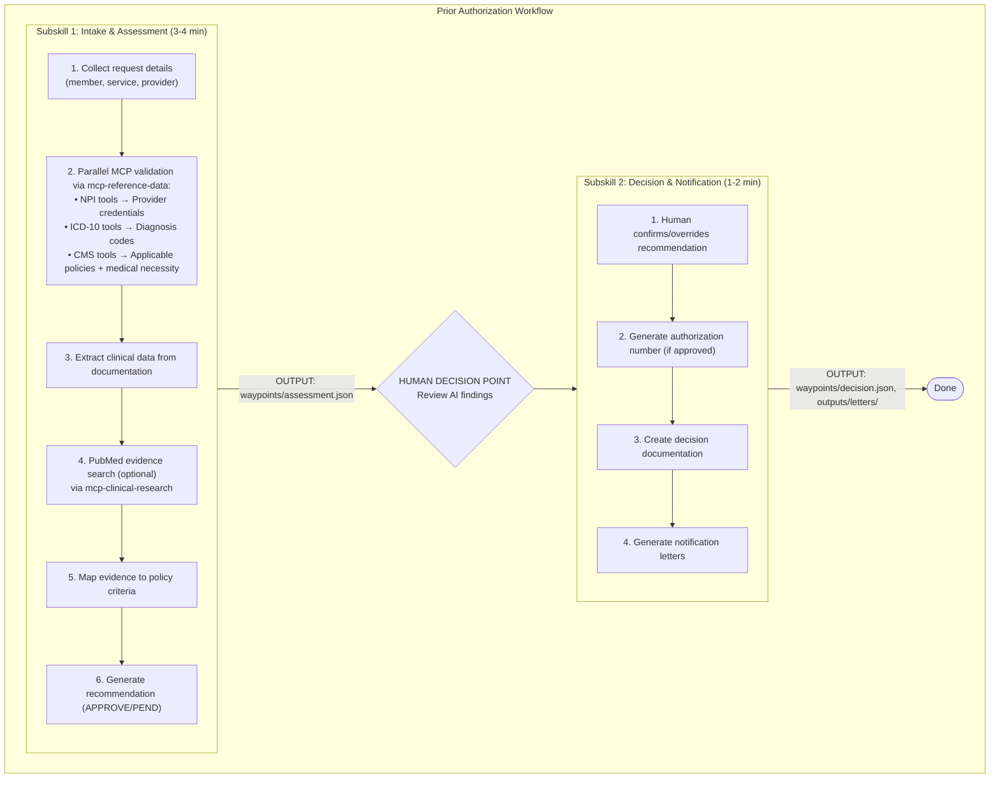

# Prior Authorization Review Skill (Azure)

Process prior authorization requests using AI-assisted review with MCP connectors for NPI Registry, ICD-10 codes, and CMS Coverage policies. This skill generates draft recommendations for human review.

**Target Users:** Prior authorization specialists, utilization management nurses, medical directors

**Key Features:**
- Two-subskill workflow (Intake & Assessment → Decision & Notification)
- Parallel MCP validation for optimal performance
- Structured waypoint files for audit trail
- Human-in-the-loop decision confirmation
- Azure APIM integration for secure MCP access

---

## Important Disclaimers

> **DRAFT RECOMMENDATIONS ONLY:** This skill generates draft recommendations only. The payer organization remains fully responsible for all final authorization decisions.
>
> **HUMAN REVIEW REQUIRED:** All AI-generated recommendations require review and confirmation by appropriate professionals before becoming final decisions. Users may accept, reject, or override any recommendation with documented justification.
>
> **AI DECISION BEHAVIOR:** AI recommends APPROVE, PEND, or DENY. DENY is recommended when a mandatory criterion is clearly NOT_MET (≥90% confidence, based on documented evidence). All decisions require human confirmation in Subskill 2. Decision logic is configurable in the skill's rubric.md file.
>
> **COVERAGE POLICY LIMITATIONS:** Coverage policies are sourced from Medicare LCDs/NCDs via the `mcp-reference-data` server (CMS Coverage tools). If this review is for a commercial or Medicare Advantage plan, payer-specific policies may differ and were not applied.

---

## Prerequisites

### Required MCP Servers (Consolidated Architecture)

The project uses **3 consolidated MCP servers** (down from ~7 individual servers). Each server bundles multiple tool domains into a single Azure Function endpoint.

1. **`mcp-reference-data`** — NPI + ICD-10 + CMS Coverage (12 tools)
   - **Endpoint:** Single Azure Function (`/mcp`) — routed via APIM or local at `http://localhost:7071/mcp`
   - **NPI Tools:** `lookup_npi(npi="...")`, `validate_npi(npi="...")`, `search_providers(...)`
   - **ICD-10 Tools:** `validate_icd10(code="...")`, `lookup_icd10(code="...")`, `search_icd10(query="...")`, `get_icd10_chapter(code_prefix="...")`
   - **CMS Tools:** `search_coverage(query="...", coverage_type="all", limit=10)`, `check_medical_necessity(cpt_code="...", icd10_codes=[...])`, `get_coverage_by_cpt(cpt_code="...")`, `get_coverage_by_icd10(icd10_code="...")`, `get_mac_jurisdiction(state="...")`
   - **Use Cases:** Provider verification, diagnosis code validation, coverage policy lookup, medical necessity checks

2. **`mcp-clinical-research`** — FHIR + PubMed + ClinicalTrials (20 tools)
   - **Endpoint:** Single Azure Function (`/mcp`) — routed via APIM or local at `http://localhost:7072/mcp`
   - **PubMed Tools:** `search_pubmed(query="...")`, `search_clinical_queries(query="...", category="therapy")`, `get_article(pmid="...")`, `get_article_abstract(pmid="...")`, `get_articles_batch(pmids=[...])`, `find_related_articles(pmid="...")`
   - **FHIR Tools:** `search_patients(identifier="...")`, `get_patient(patient_id="...")`, `get_patient_conditions(patient_id="...")`, `get_patient_medications(patient_id="...")`, `get_patient_observations(patient_id="...")`, `get_patient_encounters(patient_id="...")`, `search_practitioners(...)`, `validate_resource(...)`
   - **ClinicalTrials Tools:** `search_trials(...)`, `get_trial(nct_id="...")`, `get_trial_eligibility(nct_id="...")`, `get_trial_locations(nct_id="...")`, `search_by_condition(...)`, `get_trial_results(nct_id="...")`
   - **Use Cases:** Evidence search via PubMed, FHIR patient data enrichment, clinical trial discovery
   - **Note:** PubMed and FHIR tools are optional for prior auth — they enhance but are not required

3. **`cosmos-rag`** — Document RAG & Audit Trail (6 tools)
   - **Endpoint:** Single Azure Function (`/mcp`) — routed via APIM or local at `http://localhost:7073/mcp`
   - **Tools:** `index_document(...)`, `hybrid_search(query="...")`, `vector_search(query="...")`, `record_audit_event(...)`, `get_audit_trail(workflow_id="...")`, `get_session_history(workflow_type="...")`
   - **Use Cases:** Coverage policy document retrieval via RAG, workflow audit trail for compliance
---

## Workflow Overview



---

## Subskill Descriptions

### Subskill 1: Intake & Assessment (3-4 minutes)
- Collects PA request details (member, service, provider, clinical docs)
- Validates provider credentials, ICD-10 codes, and coverage policies via **`mcp-reference-data`** (NPI + ICD-10 + CMS — parallel execution)
- Validates CPT/HCPCS codes via **WebFetch to CMS Fee Schedule**
- Extracts structured clinical data from documentation
- Searches for supporting literature via **`mcp-clinical-research`** PubMed tools (optional, strengthens evidence)
- Enriches clinical context via **`mcp-clinical-research`** FHIR tools (optional)
- Maps clinical evidence to policy criteria
- Performs medical necessity assessment
- Generates recommendation (APPROVE/PEND)
- **Output:** `waypoints/assessment.json` (consolidated)
- **Data Sources:** `mcp-reference-data` (NPI + ICD-10 + CMS, parallel), CMS Fee Schedule (web), `mcp-clinical-research` (PubMed + FHIR, optional)

### Subskill 2: Decision & Notification (1-2 minutes)
- Reads assessment from Subskill 1
- Presents findings for human review
- Accepts human confirmation or override
- Generates authorization number (if approved)
- Creates decision waypoint
- Generates notification letters (approval/denial/pend)
- Generates standardized determination JSON for downstream systems
- **Output:** `waypoints/decision.json`, `outputs/determination.json`, `outputs/approval_letter.md` or `outputs/pend_letter.md` or `outputs/denial_letter.md`

---

## Execution Flow

### Startup: Request Input Files

**Option A: User provides files**
```
To begin a prior authorization review, I need:
  1. PA Request Form (member info, service details)
  2. Clinical Documentation (progress notes, test results)
  3. Provider Information (NPI, credentials)

Please provide the file paths or paste the content.
```

**Option B: Demo mode**
```
Would you like to use sample PA request files for demonstration?
Sample files are in: data/sample_cases/prior_auth_baseline/
```

- **Demo mode note:** When sample files are used, the sample data contains demo NPI and sample member ID. This combination triggers demo mode, which skips the NPI lookup for this specific provider only. All other MCP calls execute normally.

---

## Beads (bd) Task Tracking

Use **beads** to track progress through the prior authorization workflow. Each major phase is a bead with a unique ID, status, and checklist. Update bead status as work progresses to maintain an auditable trail and enable reliable resume.

### Bead Definitions

| Bead ID | Phase | Description |
|---------|-------|-------------|
| `bd-pa-001-intake` | Subskill 1, Steps 1-3 | Collect request info + parallel MCP validation |
| `bd-pa-002-clinical` | Subskill 1, Steps 4-6 | Clinical extraction + rubric read + evidence mapping |
| `bd-pa-003-recommend` | Subskill 1, Steps 7-10 | Generate recommendation + write waypoint + audit doc |
| `bd-pa-004-decision` | Subskill 2, Steps 1-5 | Human review + decision capture + authorization |
| `bd-pa-005-notify` | Subskill 2, Steps 6-7 | Generate notification letters + completion summary |

### Bead Lifecycle

```
not-started → in-progress → completed
```

- **not-started**: Bead has not begun (default)
- **in-progress**: Actively executing this phase (only ONE bead active at a time)
- **completed**: All checklist items done, outputs verified

### Tracking Rules

1. **Mark bead in-progress** before starting its first task
2. **Check off items** as each step completes
3. **Mark bead completed** only after all outputs are verified
4. **Never skip beads** — execute in order (`bd-pa-001` → `bd-pa-005`)
5. **On resume**, scan bead statuses to find the first non-completed bead and continue from there
6. **Persist bead state** in `waypoints/assessment.json` under a `"beads"` key so progress survives interruptions

### Bead State in Waypoint Files

Include bead tracking in waypoint JSON files:

```json
{
  "beads": [
    {"id": "bd-pa-001-intake",    "status": "completed", "completed_at": "ISO datetime"},
    {"id": "bd-pa-002-clinical",   "status": "completed", "completed_at": "ISO datetime"},
    {"id": "bd-pa-003-recommend",  "status": "in-progress", "started_at": "ISO datetime"},
    {"id": "bd-pa-004-decision",   "status": "not-started"},
    {"id": "bd-pa-005-notify",     "status": "not-started"}
  ]
}
```

### Resume via Beads

On startup, if `waypoints/assessment.json` exists:
1. Read the `"beads"` array
2. Find the first bead that is NOT `"completed"`
3. Display bead progress summary to user
4. Offer to resume from that bead

---

## Prompt Modules (Context-Optimized)

Structured prompt guidance is organized into **5 phase-aligned modules** in `references/prompts/`. Each module is loaded lazily — **only when its bead starts** — and released at the next context checkpoint.

### Module Loading Table

| Bead | Module(s) to Read | Peak Tokens | Release After |
|------|-------------------|-------------|---------------|
| `bd-pa-001-intake` | `01-extraction.md` + `02-policy-retrieval.md` | ~270 lines | Context Checkpoint 1 (waypoint write) |
| `bd-pa-002-clinical` | `03-clinical-assessment.md` | ~120 lines | Context Checkpoint 2 (waypoint update) |
| `bd-pa-003-recommend` | `04-determination.md` + `rubric.md` | ~150 lines | Context Checkpoint 3 (waypoint finalize) |
| `bd-pa-004-decision` | *(none — human review)* | ~0 | Context Checkpoint 4 (decision.json write) |
| `bd-pa-005-notify` | `05-output-formatting.md` | ~100 lines | Workflow complete |

### Loading Rules

1. **Read the prompt module(s)** listed for the current bead BEFORE starting that bead's work
2. **Do NOT pre-load** modules for future beads
3. **After each context checkpoint**, the prior bead's modules and raw data are captured in the waypoint and no longer needed

---

## Context Management

Waypoint files serve as **context checkpoints** — they compress raw data into structured summaries so downstream beads operate on compact representations instead of replaying all upstream context.

### Context Checkpoints

| Checkpoint | Trigger | What Gets Compressed | Waypoint Section |
|------------|---------|---------------------|------------------|
| **CP1** | Bead 001 complete | Raw clinical docs, MCP tool results, extraction prompts | `assessment.{request, clinical, policy}` |
| **CP2** | Bead 002 complete | Policy full text, evidence mapping work, assessment prompt | `assessment.criteria_evaluation` |
| **CP3** | Bead 003 complete | Determination reasoning, rubric rules | `assessment.recommendation` |
| **CP4** | Bead 004 complete | Assessment details, human decision | `decision.{decision, rationale, audit}` |

### Context Scope Rules Per Bead

Each bead defines what to read and what to ignore:

**Bead 001** (Intake): Read raw docs + prompt modules 01, 02. Full context access.

**Bead 002** (Clinical): Read `assessment.json` sections + prompt module 03. **Ignore** raw docs, MCP results, modules 01-02.

**Bead 003** (Recommend): Read `assessment.json` evaluation + `rubric.md` + prompt module 04. **Ignore** raw docs, prior modules.

**Bead 004** (Decision): Read `assessment.json` recommendation only + human input. **Ignore** everything else.

**Bead 005** (Notify): Read `decision.json` + `assessment.json` member/service/provider + `criteria_evaluation` + `recommendation.gaps` + prompt module 05. **Ignore** raw clinical documents and raw MCP responses.

**The waypoint is the source of truth for downstream beads.** Do not re-read raw inputs.

---

## Implementation Requirements

1. **Always read subskill files:** Don't execute from memory. Read the actual subskill markdown file and follow instructions.

2. **Load prompt modules per bead:** Read the prompt module(s) listed in the Module Loading Table when starting each bead. Do not pre-load modules for future beads.

3. **Auto-detect resume:** Check for existing `waypoints/assessment.json` on startup. If found, read bead state and offer to resume from the first incomplete bead.

4. **Parallel MCP execution:** In Subskill 1, execute NPI, ICD-10, and Coverage MCP calls in parallel for optimal performance.

5. **Preserve user data:** Never overwrite waypoint files without asking confirmation or backing up.

6. **Clear progress indicators:** Show users what's happening during operations (MCP queries, data analysis). Update bead status in real-time.

7. **Graceful degradation:** If optional data missing, continue with available data and note limitations.

8. **Validate outputs:** Check that waypoint files have expected structure before proceeding.

9. **Track beads:** Update bead status at every phase transition. Persist bead state in waypoint files for resume capability.

10. **Respect context scoping:** At each bead, read only what the Context Scope Rules specify. Use waypoint data instead of re-reading raw inputs from prior beads.

### MCP Tool Call Transparency (REQUIRED)

When invoking MCP tools, always inform the user:
- BEFORE: What tool is being called and why
- AFTER: Success notification with summary of results

**Example:**
```
Searching mcp-reference-data for applicable coverage policies...
✅ CMS coverage search completed - Found policy: L34567 - Knee Arthroplasty LCD
```

### Common Mistakes to Avoid

**MCP and Validation:**
- ❌ Don't call `validate_icd10()` in a loop if avoidable - consider parallelizing calls
- ❌ Don't call `lookup_icd10()` with array parameter - it takes a single code string only
- ❌ Don't skip CPT/HCPCS validation - it's required even though no MCP exists
- ❌ Don't forget to display MCP success notifications after each connector invocation

**Decision Policy Enforcement (CRITICAL):**
- ❌ Don't ignore provider verification status when calculating recommendation
- ❌ Don't make decisions without first reading rubric.md
- ✅ DO read rubric.md FIRST to understand current policy
- ✅ DO apply the decision rules specified in rubric.md

---

## Error Handling

**Missing MCP Servers:**
If required MCP connectors not available, display error listing missing connectors.

**Missing Subskill Prerequisites:**
If Subskill 2 invoked without `waypoints/assessment.json`, notify user to complete Subskill 1 first.

**File Write Errors:**
If unable to write waypoint files, display error with file path, check permissions/disk space, and offer retry.

**Data Quality Issues:**
If clinical data extraction confidence <60%, warn user with confidence score and low-confidence areas. Offer options to: continue, request additional documentation, or abort.

---

## Quality Checks

Before completing workflow, verify:

- [ ] All beads (`bd-pa-001` through `bd-pa-005`) marked completed
- [ ] All required waypoint files created
- [ ] Decision has clear rationale documented
- [ ] All required fields populated
- [ ] Output files generated successfully
- [ ] Bead state in waypoints reflects final status

---

## Sample Data

Sample case files are included in `data/sample_cases/prior_auth_baseline/` for demonstration purposes. When using sample files, the skill operates in demo mode which:

- Skips NPI lookup for the sample provider only
- Executes all other MCP calls (ICD-10, CMS Coverage) normally
- Demonstrates the complete workflow with a pre-configured case

---

## Evaluation Data

A curated evaluation dataset is available in `data/` for benchmarking and demo purposes. All data is de-identified/synthetic.

### Dataset Structure

```
data/
├── cases/
│   ├── ground_truth.json          # Aggregated ground truth for all case variants
│   └── {001-005}/{a,b}/           # Case variants
│       ├── results.json           # Per-case decision (approved/rejected)
│       ├── pa_form/               # Prior auth request form (PDF)
│       ├── doctor_notes/          # Clinical notes (PDF)
│       ├── labs/                  # Lab results (PDF, if applicable)
│       └── imaging/               # Imaging reports (PDF, if applicable)
├── policies/                      # Indexed retrieval corpus (coverage policy PDFs)
│   ├── 001.pdf
│   ├── 002.pdf
│   ├── 003.pdf
│   ├── 004.pdf
│   └── 005.pdf
├── sample_cases/
│   └── prior_auth_baseline/
│       ├── pa_request.json
│       ├── ct_chest_report.txt
│       ├── pet_scan_report.txt
│       └── pulmonology_consultation.txt
└── pdfs/                          # Pre-rendered page images for select cases
```

### Case Catalog

| Case | Variant | Decision | Docs Included |
|------|---------|----------|---------------|
| 001 | a | rejected | PA form, notes, labs, imaging |
| 001 | b | approved | PA form, notes, labs, imaging |
| 002 | a | approved | PA form, notes, labs, imaging |
| 002 | b | approved | PA form, notes, labs, imaging |
| 003 | a | approved | PA form, notes, labs |
| 003 | b | approved | PA form, notes, labs |
| 004 | a | approved | PA form, notes |
| 004 | b | approved | PA form, notes |
| 005 | a | approved | PA form, notes, labs, imaging |
| 005 | b | approved | PA form, notes, labs, imaging |

### How to Use

**Interactive demo (single case):**
```
Run the prior-auth skill using case data/cases/001/a/ — this is a rejected case with full documentation.
```

**Evaluation mode:**
Use `data/cases/ground_truth.json` to compare skill recommendations against MD-reviewed ground truth decisions across all 10 case variants.

Each case variant includes:
- **a/b pattern**: Variant `a` and `b` for the same clinical scenario, sometimes with different outcomes (e.g., 001_a rejected vs 001_b approved), enabling testing of the skill's sensitivity to documentation quality and completeness.
- **`results.json`**: Per-variant ground truth with `case_id`, `decision`, `evaluation_time`, and `notes`.
- **`../policies/`**: Coverage policy PDFs (one per case number) used as the indexed retrieval corpus.

### Ground Truth Schema

```json
{
  "<case_id>": {
    "doctor_notes": ["cases/.../notes.pdf"],
    "imaging": ["cases/.../imaging.pdf"],
    "labs": ["cases/.../labs.pdf"],
    "pa_form": ["cases/.../form.pdf"],
    "policies": [],
    "evaluation_time": "ISO datetime",
    "decision": "approved | rejected",
    "notes": "Evaluation context"
  }
}
```

> **Note:** File paths in `ground_truth.json` are relative to `data/`. The `policies` field is currently empty and reserved for linking case-specific policy references in future iterations.

---

## Azure-Specific Integration

### Azure APIM Endpoint Configuration

```yaml
mcp_servers:
  mcp-reference-data:
    url: https://healthcare-mcp.azure-api.net/reference-data
    auth: azure_ad_token
    # Serves: NPI lookup, ICD-10 validation, CMS coverage (12 tools)
  mcp-clinical-research:
    url: https://healthcare-mcp.azure-api.net/clinical-research
    auth: azure_ad_token
    # Serves: FHIR, PubMed, ClinicalTrials.gov (20 tools)
  cosmos-rag:
    url: https://healthcare-mcp.azure-api.net/cosmos-rag
    auth: azure_ad_token
    # Serves: Document RAG, audit trail (6 tools)
```

### FHIR Integration

Assessment data can be stored as FHIR resources:

```json
{
  "resourceType": "Claim",
  "use": "preauthorization",
  "status": "active",
  "patient": { "reference": "Patient/123" },
  "insurance": [{ "coverage": { "reference": "Coverage/456" }}]
}
```
