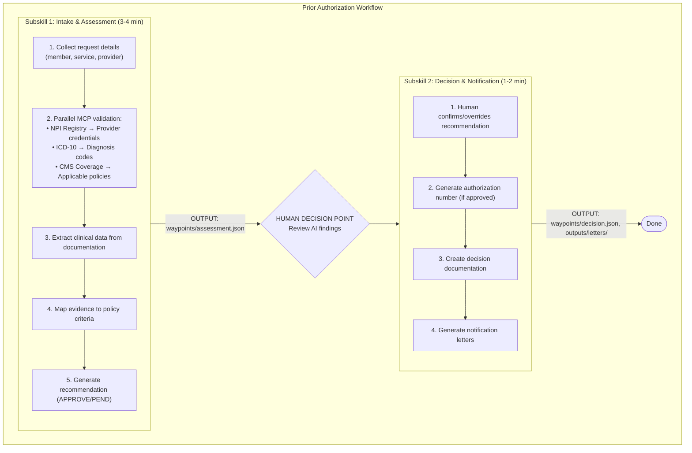

# Prior Authorization Review Skill (Azure)

Process prior authorization requests using AI-assisted review with MCP connectors for NPI Registry, ICD-10 codes, and CMS Coverage policies. This skill generates draft recommendations for human review.

**Target Users:** Prior authorization specialists, utilization management nurses, medical directors

**Key Features:**
- Two-subskill workflow (Intake & Assessment → Decision & Notification)
- Parallel MCP validation for optimal performance
- Structured waypoint files for audit trail
- Human-in-the-loop decision confirmation
- Azure APIM integration for secure MCP access

---

## Important Disclaimers

> **DRAFT RECOMMENDATIONS ONLY:** This skill generates draft recommendations only. The payer organization remains fully responsible for all final authorization decisions.
>
> **HUMAN REVIEW REQUIRED:** All AI-generated recommendations require review and confirmation by appropriate professionals before becoming final decisions. Users may accept, reject, or override any recommendation with documented justification.
>
> **AI DECISION BEHAVIOR:** In default mode, AI recommends APPROVE or PEND only - never recommends DENY. Decision logic is configurable in the skill's rubric.md file.
>
> **COVERAGE POLICY LIMITATIONS:** Coverage policies are sourced from Medicare LCDs/NCDs via CMS Coverage MCP Connector. If this review is for a commercial or Medicare Advantage plan, payer-specific policies may differ and were not applied.

---

## Prerequisites

### Required MCP Servers (via Azure APIM)

1. **NPI MCP Connector** - Provider verification
   - **Endpoint:** `https://healthcare-mcp.azure-api.net/npi-registry`
   - **Tools:** `npi_lookup_provider(npi="...")`, `npi_verify_credentials(...)`
   - **Use Cases:** Verify provider credentials, specialty, license state, active status

2. **ICD-10 MCP Connector** - Diagnosis code validation
   - **Endpoint:** `https://healthcare-mcp.azure-api.net/icd10`
   - **Tools:** `icd10_validate(codes=[...])`, `icd10_get_details(code="...")`
   - **Use Cases:** Batch validate ICD-10 codes, get detailed code information

3. **CMS Coverage MCP Connector** - Policy lookup
   - **Endpoint:** `https://healthcare-mcp.azure-api.net/cms-coverage`
   - **Tools:** `cms_search_all(search_term="...", state="...", max_results=10)`
   - **Use Cases:** Find applicable LCDs/NCDs for service

---

## Workflow Overview



---

## Subskill Descriptions

### Subskill 1: Intake & Assessment (3-4 minutes)
- Collects PA request details (member, service, provider, clinical docs)
- Validates provider credentials via **NPI MCP**
- Validates and retrieves ICD-10 code details via **ICD-10 MCP** (single batch call)
- Validates CPT/HCPCS codes via **WebFetch to CMS Fee Schedule**
- Searches coverage policies via **CMS Coverage MCP**
- Extracts structured clinical data from documentation
- Maps clinical evidence to policy criteria
- Performs medical necessity assessment
- Generates recommendation (APPROVE/PEND)
- **Output:** `waypoints/assessment.json` (consolidated)
- **Data Sources:** NPI MCP, ICD-10 MCP, CMS Coverage MCP (parallel), CMS Fee Schedule (web)

### Subskill 2: Decision & Notification (1-2 minutes)
- Reads assessment from Subskill 1
- Presents findings for human review
- Accepts human confirmation or override
- Generates authorization number (if approved)
- Creates decision waypoint
- Generates notification letters (approval/denial/pend)
- **Output:** `waypoints/decision.json`, `outputs/approval_letter.md` or `outputs/pend_letter.md`

---

## Execution Flow

### Startup: Request Input Files

**Option A: User provides files**
```
To begin a prior authorization review, I need:
  1. PA Request Form (member info, service details)
  2. Clinical Documentation (progress notes, test results)
  3. Provider Information (NPI, credentials)

Please provide the file paths or paste the content.
```

**Option B: Demo mode**
```
Would you like to use sample PA request files for demonstration?
Sample files are in: assets/sample/
```

- **Demo mode note:** When sample files are used, the sample data contains demo NPI and sample member ID. This combination triggers demo mode, which skips the NPI MCP lookup for this specific provider only. All other MCP calls execute normally.

---

## Beads (bd) Task Tracking

Use **beads** to track progress through the prior authorization workflow. Each major phase is a bead with a unique ID, status, and checklist. Update bead status as work progresses to maintain an auditable trail and enable reliable resume.

### Bead Definitions

| Bead ID | Phase | Description |
|---------|-------|-------------|
| `bd-pa-001-intake` | Subskill 1, Steps 1-3 | Collect request info + parallel MCP validation |
| `bd-pa-002-clinical` | Subskill 1, Steps 4-6 | Clinical extraction + rubric read + evidence mapping |
| `bd-pa-003-recommend` | Subskill 1, Steps 7-10 | Generate recommendation + write waypoint + audit doc |
| `bd-pa-004-decision` | Subskill 2, Steps 1-5 | Human review + decision capture + authorization |
| `bd-pa-005-notify` | Subskill 2, Steps 6-7 | Generate notification letters + completion summary |

### Bead Lifecycle

```
not-started → in-progress → completed
```

- **not-started**: Bead has not begun (default)
- **in-progress**: Actively executing this phase (only ONE bead active at a time)
- **completed**: All checklist items done, outputs verified

### Tracking Rules

1. **Mark bead in-progress** before starting its first task
2. **Check off items** as each step completes
3. **Mark bead completed** only after all outputs are verified
4. **Never skip beads** — execute in order (`bd-pa-001` → `bd-pa-005`)
5. **On resume**, scan bead statuses to find the first non-completed bead and continue from there
6. **Persist bead state** in `waypoints/assessment.json` under a `"beads"` key so progress survives interruptions

### Bead State in Waypoint Files

Include bead tracking in waypoint JSON files:

```json
{
  "beads": [
    {"id": "bd-pa-001-intake",    "status": "completed", "completed_at": "ISO datetime"},
    {"id": "bd-pa-002-clinical",   "status": "completed", "completed_at": "ISO datetime"},
    {"id": "bd-pa-003-recommend",  "status": "in-progress", "started_at": "ISO datetime"},
    {"id": "bd-pa-004-decision",   "status": "not-started"},
    {"id": "bd-pa-005-notify",     "status": "not-started"}
  ]
}
```

### Resume via Beads

On startup, if `waypoints/assessment.json` exists:
1. Read the `"beads"` array
2. Find the first bead that is NOT `"completed"`
3. Display bead progress summary to user
4. Offer to resume from that bead

---

## Implementation Requirements

1. **Always read subskill files:** Don't execute from memory. Read the actual subskill markdown file and follow instructions.

2. **Auto-detect resume:** Check for existing `waypoints/assessment.json` on startup. If found, read bead state and offer to resume from the first incomplete bead.

3. **Parallel MCP execution:** In Subskill 1, execute NPI, ICD-10, and Coverage MCP calls in parallel for optimal performance.

4. **Preserve user data:** Never overwrite waypoint files without asking confirmation or backing up.

5. **Clear progress indicators:** Show users what's happening during operations (MCP queries, data analysis). Update bead status in real-time.

6. **Graceful degradation:** If optional data missing, continue with available data and note limitations.

7. **Validate outputs:** Check that waypoint files have expected structure before proceeding.

8. **Track beads:** Update bead status at every phase transition. Persist bead state in waypoint files for resume capability.

### MCP Tool Call Transparency (REQUIRED)

When invoking MCP tools, always inform the user:
- BEFORE: What tool is being called and why
- AFTER: Success notification with summary of results

**Example:**
```
Searching CMS Coverage MCP for applicable policies...
✅ CMS Coverage MCP completed - Found policy: L34567 - Knee Arthroplasty LCD
```

### Common Mistakes to Avoid

**MCP and Validation:**
- ❌ Don't call `icd10_validate()` multiple times - validate all codes in one batch
- ❌ Don't call `icd10_get_details()` with array parameter - it takes single code only
- ❌ Don't skip CPT/HCPCS validation - it's required even though no MCP exists
- ❌ Don't forget to display MCP success notifications after each connector invocation

**Decision Policy Enforcement (CRITICAL):**
- ❌ Don't ignore provider verification status when calculating recommendation
- ❌ Don't make decisions without first reading rubric.md
- ✅ DO read rubric.md FIRST to understand current policy
- ✅ DO apply the decision rules specified in rubric.md

---

## Error Handling

**Missing MCP Servers:**
If required MCP connectors not available, display error listing missing connectors.

**Missing Subskill Prerequisites:**
If Subskill 2 invoked without `waypoints/assessment.json`, notify user to complete Subskill 1 first.

**File Write Errors:**
If unable to write waypoint files, display error with file path, check permissions/disk space, and offer retry.

**Data Quality Issues:**
If clinical data extraction confidence <60%, warn user with confidence score and low-confidence areas. Offer options to: continue, request additional documentation, or abort.

---

## Quality Checks

Before completing workflow, verify:

- [ ] All beads (`bd-pa-001` through `bd-pa-005`) marked completed
- [ ] All required waypoint files created
- [ ] Decision has clear rationale documented
- [ ] All required fields populated
- [ ] Output files generated successfully
- [ ] Bead state in waypoints reflects final status

---

## Sample Data

Sample case files are included in `assets/sample/` for demonstration purposes. When using sample files, the skill operates in demo mode which:

- Skips NPI MCP lookup for the sample provider only
- Executes all other MCP calls (ICD-10, CMS Coverage) normally
- Demonstrates the complete workflow with a pre-configured case

---

## Azure-Specific Integration

### Azure APIM Endpoint Configuration

```yaml
mcp_servers:
  npi-registry:
    url: https://healthcare-mcp.azure-api.net/npi-registry
    auth: azure_ad_token
  icd10-codes:
    url: https://healthcare-mcp.azure-api.net/icd10
    auth: azure_ad_token
  cms-coverage:
    url: https://healthcare-mcp.azure-api.net/cms-coverage
    auth: azure_ad_token
```

### FHIR Integration

Assessment data can be stored as FHIR resources:

```json
{
  "resourceType": "Claim",
  "use": "preauthorization",
  "status": "active",
  "patient": { "reference": "Patient/123" },
  "insurance": [{ "coverage": { "reference": "Coverage/456" }}]
}
```
