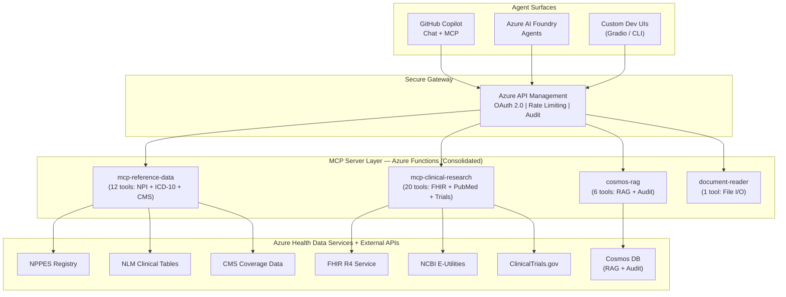
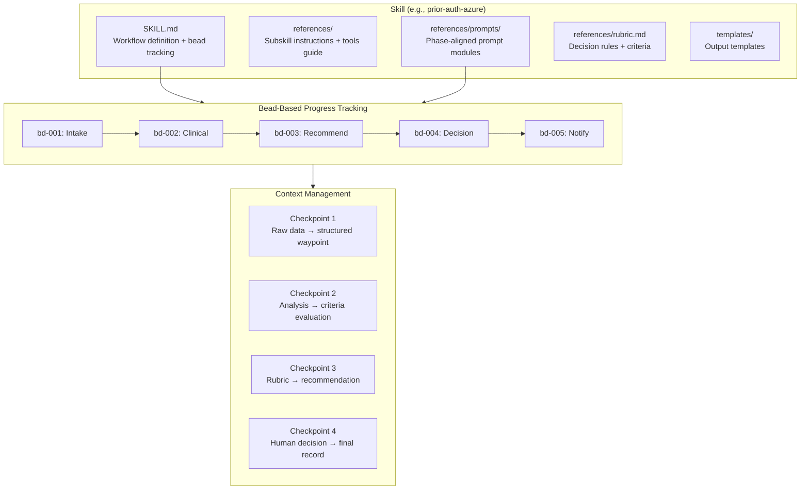
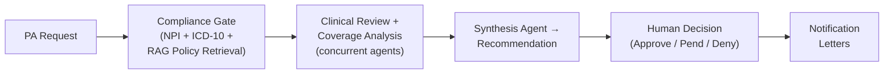

# Healthcare Agent Accelerator for Azure

**Secure, production-patterned AI agents for healthcare workflows — built on Azure infrastructure and the Model Context Protocol (MCP).**

---

## The Problem

Prior Authorization (PA) is one of healthcare’s most broken processes. It sits at the intersection of providers, payors, and patients — and it fails all three.

### By the Numbers

| Stakeholder | Pain Point | Impact |
|-------------|-----------|--------|
| **Providers** | 41 PA requests/week per physician, ~13 hours of staff time | 88% report high/extreme administrative burden |
| **Payors** | 75% of PA tasks remain manual, ~$3.14 per transaction | Up to 75% inaccuracy in manual approval decisions |
| **Patients** | 93% of physicians say PA delays necessary care | 82% treatment abandonment; cancer delays increase mortality 1.2–3.2% |

> Sources: [AMA](https://www.ama-assn.org/), [Sagility Health](https://sagilityhealth.com/), [McKinsey AI Insights](https://www.mckinsey.com/)

### Regulatory Pressure Is Accelerating

**CMS 2026 regulations** now mandate:

- **Real-time data exchange** via HL7 FHIR APIs — 72 hours for urgent, 7 days for standard PA decisions
- **Transparent decision rationale** — payors must provide detailed explanations for every PA outcome
- **FHIR-driven interoperability** across all participating systems

Healthcare organizations need to modernize — but building AI agents that handle clinical data requires more than prompt engineering. It requires **secure infrastructure, compliance-ready patterns, and interoperable tooling**.

---

## What This Project Does

This accelerator demonstrates how to build **healthcare AI agents on Azure** using established, secure patterns — not prototypes stitched together with API keys and hope.

It provides:

1. **Consolidated MCP Servers** — Four domain-grouped Azure Function servers exposing 39 healthcare tools (NPI, ICD-10, CMS, FHIR, PubMed, Clinical Trials, Cosmos DB RAG, document reading) via the [Model Context Protocol](https://modelcontextprotocol.io/docs)
2. **Agent Workflows** — Multi-step orchestration for prior authorization, clinical trial matching, literature search, and patient data — with audit trails and human-in-the-loop checkpoints
3. **Skills & Prompt Engineering Layer** — Six domain skills with phase-aligned prompt modules, lazy context loading, bead-based progress tracking, and rubric-driven decision logic
4. **Azure-Native Security** — APIM gateway with OAuth 2.0 / Entra ID, managed identity throughout, Private Link, HIPAA-ready Bicep infrastructure
5. **Multiple Agent Surfaces** — Works with GitHub Copilot, Azure AI Foundry Agents, and custom orchestration UIs (Gradio + CLI)

### What Makes This Different

| Concern | Typical AI Demo | This Accelerator |
|---------|----------------|------------------|
| **Authentication** | Hardcoded API keys | Entra ID + managed identity + APIM gateway |
| **Data access** | Mock responses | Live FHIR, NPI, CMS, PubMed, ClinicalTrials.gov APIs |
| **Compliance** | Hand-waved | Private Link, audit logging, HIPAA-tagged infrastructure |
| **Tooling protocol** | Bespoke function calling | Model Context Protocol (MCP) — open, portable, model-agnostic |
| **Prompt engineering** | Monolithic system prompt | Phase-aligned prompt modules with lazy loading and context checkpoints |
| **Deployment** | localhost only | `azd up` → full Azure deployment with APIM, Functions, AHDS |
| **Auditability** | None | Waypoint-based audit trail with bead tracking per workflow step |

---

## Business Value

### For Healthcare IT Teams

- **40% reduction** in PA processing costs through AI-enabled auto-assessment of low-risk cases
- **Days → Hours** turnaround on PA decisions, aligning with CMS 2026 mandates
- **75% fewer** manual errors by grounding decisions in real-time clinical data (NPI, ICD-10, CMS policy)
- **One architecture** supporting GitHub Copilot, Azure AI Foundry, and custom agent surfaces

### For Platform & Security Teams

- **Zero secrets in code** — managed identity from MCP server to FHIR endpoint
- **APIM as the single front door** — rate limiting, JWT validation, audit logging, IP filtering
- **Infrastructure as Code** — fully deployable via `azd up` with Bicep modules
- **HIPAA-ready** — Private Link, encryption at rest, diagnostic logging, BAA-eligible services

### For Developers

- **Open protocol** — MCP servers work with any MCP-compatible client, not locked to one vendor
- **Local-first development** — run all four servers locally with `make local-start`
- **Evals built in** — contract validation, latency benchmarks, and native framework evaluation out of the box

---

## Architecture



---

## MCP Servers

The project uses **4 consolidated MCP servers** — each bundles multiple tool domains into a single Azure Function endpoint, reducing deployment surface and simplifying routing. All servers implement MCP Protocol 2025-06-18 with Streamable HTTP transport.

| Server | Port | Tools | Domains | Upstream Data Sources |
|--------|------|-------|---------|----------------------|
| **mcp-reference-data** | 7071 | 12 | NPI, ICD-10, CMS | NPPES Registry, NLM Clinical Tables, CMS Coverage KB |
| **mcp-clinical-research** | 7072 | 20 | FHIR, PubMed, Clinical Trials | Azure FHIR R4, NCBI E-Utilities, ClinicalTrials.gov v2 |
| **cosmos-rag** | 7073 | 6 | Document RAG, Audit Trail | Azure Cosmos DB (DiskANN vectors + BM25 full-text) |
| **document-reader** | 7078 | 1 | File I/O | Local filesystem |

<details>
<summary><strong>mcp-reference-data</strong> — 12 tools</summary>

| Domain | Tool | Description |
|--------|------|-------------|
| NPI | `lookup_npi` | Look up provider by NPI number |
| NPI | `search_providers` | Search providers by name, specialty, location |
| NPI | `validate_npi` | Validate NPI via Luhn algorithm |
| ICD-10 | `validate_icd10` | Validate ICD-10-CM code format and existence |
| ICD-10 | `lookup_icd10` | Look up code description, category, related codes |
| ICD-10 | `search_icd10` | Search codes by keyword |
| ICD-10 | `get_icd10_chapter` | Get codes in a chapter by prefix |
| CMS | `search_coverage` | Search Medicare LCD/NCD coverage policies |
| CMS | `check_medical_necessity` | Check if procedure is medically necessary for diagnosis |
| CMS | `get_coverage_by_cpt` | Get coverage policies for a CPT/HCPCS code |
| CMS | `get_coverage_by_icd10` | Get coverage policies for a diagnosis code |
| CMS | `get_mac_jurisdiction` | Get MAC jurisdiction by state |

</details>

<details>
<summary><strong>mcp-clinical-research</strong> — 20 tools</summary>

| Domain | Tool | Description |
|--------|------|-------------|
| FHIR | `search_patients` | Search patients by name, DOB, identifier |
| FHIR | `get_patient` | Get patient by FHIR resource ID |
| FHIR | `get_patient_conditions` | Get patient's active conditions |
| FHIR | `get_patient_medications` | Get patient's medications |
| FHIR | `get_patient_observations` | Get patient's observations (labs, vitals) |
| FHIR | `get_patient_encounters` | Get patient's encounters |
| FHIR | `search_practitioners` | Search healthcare practitioners |
| FHIR | `validate_resource` | Validate a FHIR resource |
| PubMed | `search_pubmed` | Search PubMed for medical literature |
| PubMed | `search_clinical_queries` | Search with clinical study filters (therapy, diagnosis) |
| PubMed | `get_article` | Get article details by PMID |
| PubMed | `get_article_abstract` | Get article abstract by PMID |
| PubMed | `get_articles_batch` | Batch retrieve multiple articles |
| PubMed | `find_related_articles` | Find related articles by PMID |
| Trials | `search_trials` | Search clinical trials by criteria |
| Trials | `search_by_condition` | Find recruiting trials for a condition near a location |
| Trials | `get_trial` | Get trial details by NCT ID |
| Trials | `get_trial_eligibility` | Get trial eligibility criteria |
| Trials | `get_trial_locations` | Get trial recruiting locations |
| Trials | `get_trial_results` | Get results for completed trials |

</details>

<details>
<summary><strong>cosmos-rag</strong> — 6 tools</summary>

| Tool | Description |
|------|-------------|
| `index_document` | Chunk, embed (text-embedding-3-large), and index documents for RAG |
| `hybrid_search` | Hybrid retrieval: vector (DiskANN) + BM25 full-text with RRF fusion |
| `vector_search` | Pure vector similarity search |
| `record_audit_event` | Record immutable audit event for compliance |
| `get_audit_trail` | Query audit trail by workflow ID |
| `get_session_history` | Query audit history across workflows by type and time range |

</details>

<details>
<summary><strong>document-reader</strong> — 1 tool</summary>

| Tool | Description |
|------|-------------|
| `read_document` | Read local files: text/structured content or base64 for PDFs/images. Workspace-safe by default. |

</details>

---

## Skills & Prompt Engineering

The project uses a **skills layer** that injects domain knowledge, structured prompt modules, and decision rubrics into AI agent context. Skills are designed for composability — each can be used independently in GitHub Copilot, Azure AI Foundry, or custom agents.

### Skills Catalog

| Skill | Description | MCP Servers Used |
|-------|-------------|------------------|
| **prior-auth-azure** | End-to-end PA review with two-subskill workflow, 5 prompt modules, rubric | mcp-reference-data, mcp-clinical-research, cosmos-rag |
| **pa-report-formatter** | Formats assessment/decision data into professional reports with Material Design iconography | None (formatting only) |
| **clinical-trial-protocol** | Multi-phase clinical trial protocol generation with literature-backed evidence | mcp-clinical-research |
| **document-reader** | Load local documents (PDFs, images, JSON/CSV) for agent consumption | document-reader |
| **azure-fhir-developer** | FHIR R4 development patterns with Azure-specific auth and coding systems | mcp-clinical-research |
| **azure-health-data-services** | DICOM imaging, MedTech device data, and FHIR integration on Azure | mcp-clinical-research |

### Prompt Engineering Architecture

Unlike monolithic system prompts, this project uses a **phase-aligned, lazy-loaded prompt architecture** that manages context windows efficiently and ensures consistent, auditable decision-making.



#### Key Design Principles

1. **Lazy module loading** — Prompt modules load only when their workflow phase (bead) starts. Each bead defines which modules to read and which to ignore, keeping context usage minimal.

2. **Context checkpoints** — Waypoint files compress raw data (MCP results, clinical docs, policy text) into structured JSON summaries. Downstream phases read the waypoint, not the raw inputs, preventing context overflow.

3. **Rubric-driven decisions** — Decision logic is externalized into `rubric.md` files. The AI reads the rubric at decision time rather than relying on training data, making criteria transparent, versioned, and auditable.

4. **Bead tracking** — Each workflow phase is tracked as a "bead" with `not-started → in-progress → completed` lifecycle. Bead state persists in waypoint files for resume-from-checkpoint capability.

5. **Context scope rules** — Each bead explicitly defines what data to read and what to ignore, preventing context pollution from upstream phases.

#### Prompt Module Structure (Prior Auth Example)

```
.github/skills/prior-auth-azure/
├── SKILL.md                           # Workflow definition, bead lifecycle, MCP tool guide
├── references/
│   ├── 01-intake-assessment.md        # Subskill 1 instructions
│   ├── 02-decision-notification.md    # Subskill 2 instructions
│   ├── rubric.md                      # Decision criteria and rules
│   ├── tools.md                       # MCP tool usage guide
│   └── prompts/                       # Phase-aligned prompt modules (lazy-loaded)
│       ├── 01-extraction.md           #   Loaded at bead 001 (intake)
│       ├── 02-policy-retrieval.md     #   Loaded at bead 001 (intake)
│       ├── 03-clinical-assessment.md  #   Loaded at bead 002 (clinical)
│       ├── 04-determination.md        #   Loaded at bead 003 (recommend)
│       └── 05-output-formatting.md    #   Loaded at bead 005 (notify)
└── templates/
    └── prior-auth-request.json        # Request template
```

#### Module Loading Timeline

| Phase (Bead) | Modules Loaded | Released After |
|--------------|----------------|----------------|
| Intake (001) | `01-extraction.md` + `02-policy-retrieval.md` | Waypoint write (CP1) |
| Clinical (002) | `03-clinical-assessment.md` | Waypoint update (CP2) |
| Recommend (003) | `04-determination.md` + `rubric.md` | Waypoint finalize (CP3) |
| Decision (004) | *(none — human review)* | Decision write (CP4) |
| Notify (005) | `05-output-formatting.md` | Workflow complete |

---

## Agent Workflows

### Prior Authorization Review

The flagship workflow demonstrates end-to-end PA processing using four specialized agents with concurrent execution and structured audit trails:



**Agents:** Compliance Agent (NPI + ICD-10 validation) → Clinical Reviewer (FHIR + PubMed + Trials) + Coverage Agent (CMS + RAG policies) run concurrently → Synthesis Agent (rubric-driven recommendation). Each phase produces auditable waypoint artifacts. The workflow supports resume-from-checkpoint via bead tracking if interrupted.

### Also Included

- **Clinical Trial Matching** — Multi-phase protocol generation with FHIR patient data, PubMed evidence, and ClinicalTrials.gov integration
- **Literature Search** — PubMed-powered research workflows with clinical query filters
- **Patient Data** — FHIR-based patient data retrieval and clinical summarization

---

## Quick Start

### Prerequisites

- Python 3.11+, Node.js 18+, Azure Functions Core Tools v4
- Azure subscription (for cloud deployment)
- GitHub Copilot (for VS Code agent surface)

### Run Locally

```bash
# Start all four MCP servers (ports 7071, 7072, 7073, 7078)
make local-start

# If you deployed with azd, sync local runtime endpoints from azd outputs
make sync-local-env

# Smoke test
curl http://localhost:7071/.well-known/mcp | jq

# Run the prior-auth workflow with sample data
cd src && source agents/.venv/bin/activate
python -m agents --workflow prior-auth --demo --local

# Seed sample payer policies into cosmos-rag (auto-syncs env + starts cosmos-rag)
make seed-data
```

### Deploy to Azure

```bash
azd up
```

This provisions APIM, Azure Functions, Azure Health Data Services, and all supporting infrastructure via Bicep.

### Use in VS Code with Copilot

Configure MCP servers in `.vscode/mcp.json`:

```jsonc
{
  "servers": {
    "healthcare-reference-data":    { "type": "http", "url": "http://localhost:7071/mcp" },
    "healthcare-clinical-research": { "type": "http", "url": "http://localhost:7072/mcp" },
    "healthcare-cosmos-rag":        { "type": "http", "url": "http://localhost:7073/mcp" },
    "healthcare-document-reader":   { "type": "http", "url": "http://localhost:7078/mcp" }
  }
}
```

Then ask in Copilot Chat:

```
Does CPT 27447 require prior auth? Validate the provider NPI and check CMS coverage.
```

---

## Project Structure

```
healthcare-agent-accelerator/
├── .github/skills/                # Domain skills for AI agent context
│   ├── prior-auth-azure/          #   PA review (2 subskills, 5 prompt modules, rubric)
│   │   ├── SKILL.md               #     Workflow + bead tracking + MCP tool guide
│   │   ├── references/prompts/    #     Phase-aligned lazy-loaded prompt modules
│   │   ├── references/rubric.md   #     Externalized decision criteria
│   │   └── templates/             #     Request/output templates
│   ├── pa-report-formatter/       #   Report formatting with Material Design icons
│   ├── clinical-trial-protocol/   #   Multi-phase trial protocol generation
│   ├── document-reader/           #   Local file ingestion (PDF, image, CSV, JSON)
│   ├── azure-fhir-developer/     #   FHIR R4 patterns + Azure auth
│   └── azure-health-data-services/
├── src/
│   ├── mcp-servers/               # Four consolidated MCP servers
│   │   ├── mcp-reference-data/    #   NPI + ICD-10 + CMS (12 tools, port 7071)
│   │   ├── mcp-clinical-research/ #   FHIR + PubMed + Trials (20 tools, port 7072)
│   │   ├── cosmos-rag/            #   RAG + Audit Trail (6 tools, port 7073)
│   │   ├── document-reader/       #   File I/O (1 tool, port 7078)
│   │   └── shared/                #   MCPServer base class + shared utilities
│   └── agents/                    # Multi-agent orchestration (CLI + Gradio UIs)
│       └── workflows/             #   prior_auth, clinical_trials, literature_search, patient_data
├── data/                          # Evaluation cases, policies, sample outputs
│   ├── cases/                     #   10 PA case variants with ground truth
│   ├── policies/                  #   Coverage policy PDFs for RAG indexing
│   └── samples/                   #   Reference output examples
├── deploy/                        # Azure Bicep infrastructure (APIM, Functions, AHDS)
├── scripts/                       # Local launchers, evals, setup CLI, deployment
│   └── setup-cli/                 #   Interactive setup wizard (make setup)
├── tests/                         # Integration tests and evaluation framework
├── docs/                          # Architecture, getting started, OAuth/PRM guides
└── AGENTS.md                      # Operational guide for coding agents
```

---

## Security & Compliance

| Layer | Control | Implementation |
|-------|---------|----------------|
| **Gateway** | OAuth 2.0 + JWT validation | Azure API Management with Entra ID |
| **Identity** | No secrets in code | Managed Identity on all Function Apps |
| **Network** | Private endpoints | Private Link for FHIR, Cosmos DB, Key Vault |
| **Encryption** | TLS 1.2+ in transit, AES at rest | Azure-managed encryption |
| **Audit** | Full request logging | APIM diagnostic logs → Log Analytics + Cosmos DB audit trail |
| **Access** | Role-based access control | FHIR Data Contributor, Cosmos DB RBAC |
| **Compliance** | HIPAA-ready infrastructure | BAA-eligible services, HIPAA tags in Bicep |

---

## Documentation

| Guide | Description |
|-------|-------------|
| [Getting Started](docs/GETTING-STARTED.md) | Setup, prerequisites, local development, MCP server reference |
| [Skills Flow Map](docs/SKILLS-FLOW-MAP.md) | Mermaid diagrams of all workflow and skill flows |
| [APIM Architecture](docs/architecture/APIM-ARCHITECTURE.md) | Gateway design, security policies, AHDS integration |
| [Retrieval Architecture](docs/architecture/RETRIEVAL-ARCHITECTURE.md) | Cosmos DB, AI Search, OCR+RAG knowledge layer |
| [MCP OAuth + PRM](docs/MCP-OAUTH-PRM.md) | OAuth / Protected Resource Metadata behavior |
| [Infrastructure](deploy/README.md) | Bicep modules and deployment details |

---

## Acknowledgements & Inspirations

This project builds on ideas from several pioneering efforts in healthcare AI:

- **[Anthropic — Claude for Health AI](https://www.anthropic.com/research/claude-for-health-ai)** — demonstrated LLM-powered prior authorization, clinical trial matching, and medical coding validation
- **[AutoAuth Solution Accelerator](https://azure-samples.github.io/autoauth-solution-accelerator/)** — Azure-native PA automation with OCR, hybrid retrieval, and AI reasoning
- **[Model Context Protocol (MCP)](https://modelcontextprotocol.io/docs)** — the open protocol enabling portable, model-agnostic tool integrations
- **[Azure Health Data Services](https://learn.microsoft.com/en-us/azure/healthcare-apis/)** — FHIR R4, DICOM, and MedTech on Azure
- **[Azure AI Foundry MCP Integration](https://learn.microsoft.com/en-us/azure/ai-foundry/agents/how-to/tools/model-context-protocol)** — native MCP support in Azure AI agents

---

## Disclaimer

This accelerator uses **de-identified sample data only** and is not validated for clinical use. AI-generated recommendations are draft outputs that always require human clinical review. Do not use this software for real healthcare decisions without proper validation, regulatory review, and clinical oversight.

## License

MIT
