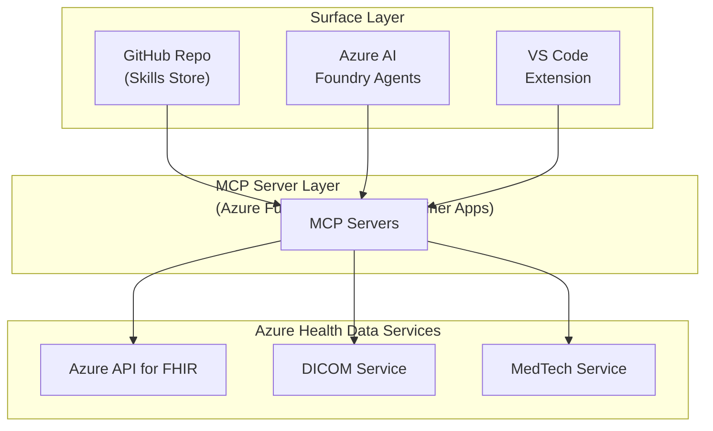

# Azure Healthcare Marketplace

> **Exploratory / Self-Learning Project** — This repository is a personal learning experiment inspired by [Anthropic's healthcare research](https://www.anthropic.com/research/claude-for-health-ai) demonstrating Claude's capabilities in healthcare AI workflows. The goal is to explore whether a similar experience can be replicated on Azure-native infrastructure using GitHub Copilot, Azure MCP Servers, and Azure Health Data Services. It is **not** a production system and should not be used for real clinical decisions.
>
> Full credit to **Anthropic and Claude** for the original vision and research that motivated this project. Their work on applying large language models to healthcare prior authorization, clinical data retrieval, and medical coding validation served as the blueprint for what's explored here.

---

An Azure-native healthcare marketplace providing Skills, MCP Servers, and AI Agent integrations for healthcare development.

## Architecture Overview



## Project Structure

```
healthcare-for-microsoft/
├── .github/skills/                # Healthcare domain skills for copilots/agents
├── src/
│   ├── mcp-servers/               # Python Azure Function MCP servers (6 domains)
│   └── agents/                    # Multi-agent orchestration CLI + dev UIs
├── scripts/                       # Local test, APIM test, and post-deploy helpers
├── docs/                          # Local testing, OAuth/PRM, architecture docs
├── deploy/                        # Azure Bicep infrastructure
├── vscode-extension/              # VS Code @healthcare participant
├── azure-fhir-mcp-server/         # Standalone TypeScript MCP server sample
└── foundry-integration/           # Azure AI Foundry registration assets
```

## Components

### 1. Skills Layer

Static knowledge injected into LLM context. Skills teach the AI *how* to do healthcare development tasks.

**Available Skills:**
- `azure-fhir-developer` - Azure API for FHIR, SMART on FHIR, bulk operations
- `azure-health-data-services` - DICOM imaging, MedTech device data
- `prior-auth-azure` - Prior authorization workflows, X12 278, Da Vinci guides

### 2. MCP Server Layer

Dynamic tools callable by AI agents for real-time data access.

**Available Tools:**
- `lookup_npi` - Validate and retrieve provider registry details
- `validate_icd10` - Validate ICD-10 diagnosis code format/existence
- `search_coverage` - Search Medicare coverage policies (LCD/NCD)
- `get_coverage_by_cpt` - Lookup coverage rules by CPT/HCPCS code
- `search_patients` - Search patients in FHIR by demographic filters
- `get_patient_observations` - Retrieve patient vitals/labs observations
- `search_pubmed` - Query PubMed literature
- `search_trials` - Query ClinicalTrials.gov studies

### 3. Foundry Integration

Register MCP servers with Azure AI Foundry for agent orchestration.

### 4. VS Code Extension

GitHub Copilot chat participant with healthcare-specific commands.

## Quick Start

### Prerequisites

- Python 3.11+
- Azure Functions Core Tools v4
- Azure subscription
- Azure Health Data Services deployed
- GitHub Copilot (for VS Code extension)

### Setup MCP Servers (Local)

```bash
make local-start

# Validate tool discovery + contract consistency
make eval-contracts
make eval-latency-local
make eval-native-local
```

### Optional: TypeScript Reference Server

`azure-fhir-mcp-server/` is a standalone TypeScript MCP sample and is not the
primary server runtime used by this repo's orchestration layer.

### Use Skills with Copilot

Skills are automatically loaded from `.github/skills/` directory. Use `@healthcare` in GitHub Copilot Chat:

```
@healthcare How do I create a Patient resource?
@healthcare /fhir What's the search syntax for observations?
@healthcare /pa Does CPT 27447 require prior auth?
```

## Documentation Guide

- [Developer Guide (leverage, test, iterate)](docs/DEVELOPER-GUIDE.md)
- [Skills Flow Map (Mermaid diagrams)](docs/SKILLS-FLOW-MAP.md)
- [MCP Servers Beginner Guide](docs/MCP-SERVERS-BEGINNER-GUIDE.md)
- [Local MCP Server Testing](docs/LOCAL-TESTING.md)
- [MCP OAuth + PRM Setup](docs/MCP-OAUTH-PRM.md)
- [De-Complexing + Evals Plan](docs/DECOMPLEX-PERF-EVALS.md)
- [APIM Architecture](docs/architecture/APIM-ARCHITECTURE.md)
- [Retrieval Architecture](docs/architecture/RETRIEVAL-ARCHITECTURE.md)
- [Infrastructure Deployment](deploy/README.md)

See [anthropic-healthcare-analysis.md](./anthropic-healthcare-analysis.md) for detailed architecture analysis.

## Security

- All FHIR endpoints require Azure AD authentication
- MCP servers use managed identity
- Private Link for HIPAA compliance
- Audit logging enabled

## Acknowledgements

This project exists because of the pioneering work by **Anthropic** on applying Claude to healthcare AI. Their published research and demos on prior authorization, clinical trial matching, and medical coding validation provided the conceptual foundation for everything here. This repo is an attempt to learn from that work and see how far the same patterns can go on Azure infrastructure with open tooling like MCP.

Key inspirations:
- [Anthropic — Claude for Health AI](https://www.anthropic.com/research/claude-for-health-ai) — the original research motivating this exploration
- [Model Context Protocol (MCP)](https://modelcontextprotocol.io/docs) — the open protocol powering tool integrations
- [Azure Health Data Services](https://learn.microsoft.com/en-us/azure/healthcare-apis/) — the Azure-native FHIR, DICOM, and MedTech stack
- [Azure AI Foundry MCP Integration](https://learn.microsoft.com/en-us/azure/ai-foundry/agents/how-to/tools/model-context-protocol)
- [VS Code Chat Extensions](https://code.visualstudio.com/api/extension-guides/chat)

## Disclaimer

This is a **learning project**. It uses only de-identified sample data and is not validated for clinical use. AI-generated recommendations are draft-only and always require human review. Do not use this software to make real healthcare decisions.

## License

MIT
