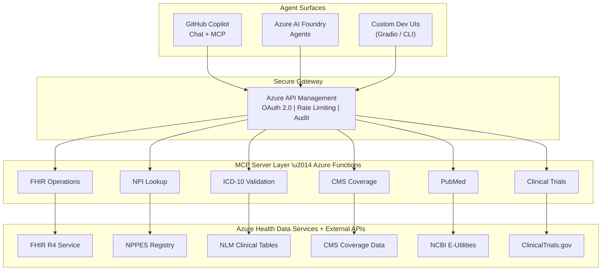
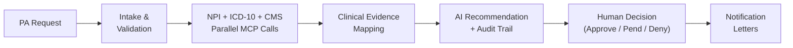

# Healthcare Agent Accelerator for Azure

**Secure, production-patterned AI agents for healthcare workflows — built on Azure infrastructure and the Model Context Protocol (MCP).**

---

## The Problem

Prior Authorization (PA) is one of healthcare’s most broken processes. It sits at the intersection of providers, payors, and patients — and it fails all three.

### By the Numbers

| Stakeholder | Pain Point | Impact |
|-------------|-----------|--------|
| **Providers** | 41 PA requests/week per physician, ~13 hours of staff time | 88% report high/extreme administrative burden |
| **Payors** | 75% of PA tasks remain manual, ~$3.14 per transaction | Up to 75% inaccuracy in manual approval decisions |
| **Patients** | 93% of physicians say PA delays necessary care | 82% treatment abandonment; cancer delays increase mortality 1.2–3.2% |

> Sources: [AMA](https://www.ama-assn.org/), [Sagility Health](https://sagilityhealth.com/), [McKinsey AI Insights](https://www.mckinsey.com/)

### Regulatory Pressure Is Accelerating

**CMS 2026 regulations** now mandate:

- **Real-time data exchange** via HL7 FHIR APIs — 72 hours for urgent, 7 days for standard PA decisions
- **Transparent decision rationale** — payors must provide detailed explanations for every PA outcome
- **FHIR-driven interoperability** across all participating systems

Healthcare organizations need to modernize — but building AI agents that handle clinical data requires more than prompt engineering. It requires **secure infrastructure, compliance-ready patterns, and interoperable tooling**.

---

## What This Project Does

This accelerator demonstrates how to build **healthcare AI agents on Azure** using established, secure patterns — not prototypes stitched together with API keys and hope.

It provides:

1. **MCP Servers** — Six production-shaped Azure Function servers exposing healthcare tools (NPI lookup, ICD-10 validation, CMS coverage, FHIR operations, PubMed, clinical trials) via the [Model Context Protocol](https://modelcontextprotocol.io/docs)
2. **Agent Workflows** — Multi-step orchestration for prior authorization, clinical trial matching, and literature search — with audit trails and human-in-the-loop checkpoints
3. **Skills Layer** — Domain knowledge injected into AI agent context for FHIR development, prior auth review, and health data services
4. **Azure-Native Security** — APIM gateway with OAuth 2.0 / Entra ID, managed identity throughout, Private Link, HIPAA-ready Bicep infrastructure
5. **Multiple Agent Surfaces** — Works with GitHub Copilot, Azure AI Foundry Agents, and custom orchestration UIs

### What Makes This Different

| Concern | Typical AI Demo | This Accelerator |
|---------|----------------|------------------|
| **Authentication** | Hardcoded API keys | Entra ID + managed identity + APIM gateway |
| **Data access** | Mock responses | Live FHIR, NPI, CMS, PubMed, ClinicalTrials.gov APIs |
| **Compliance** | Hand-waved | Private Link, audit logging, HIPAA-tagged infrastructure |
| **Tooling protocol** | Bespoke function calling | Model Context Protocol (MCP) — open, portable, model-agnostic |
| **Deployment** | localhost only | `azd up` → full Azure deployment with APIM, Functions, AHDS |
| **Auditability** | None | Waypoint-based audit trail with bead tracking per workflow step |

---

## Business Value

### For Healthcare IT Teams

- **40% reduction** in PA processing costs through AI-enabled auto-assessment of low-risk cases
- **Days → Hours** turnaround on PA decisions, aligning with CMS 2026 mandates
- **75% fewer** manual errors by grounding decisions in real-time clinical data (NPI, ICD-10, CMS policy)
- **One architecture** supporting GitHub Copilot, Azure AI Foundry, and custom agent surfaces

### For Platform & Security Teams

- **Zero secrets in code** — managed identity from MCP server to FHIR endpoint
- **APIM as the single front door** — rate limiting, JWT validation, audit logging, IP filtering
- **Infrastructure as Code** — fully deployable via `azd up` with Bicep modules
- **HIPAA-ready** — Private Link, encryption at rest, diagnostic logging, BAA-eligible services

### For Developers

- **Open protocol** — MCP servers work with any MCP-compatible client, not locked to one vendor
- **Local-first development** — run all six servers locally with `make local-start`
- **Evals built in** — contract validation, latency benchmarks, and native framework evaluation out of the box

---

## Architecture



---

## MCP Servers

Each server is an Azure Function exposing healthcare tools via JSON-RPC over HTTP (MCP Streamable HTTP transport).

| Server | Tools | Upstream Data Source |
|--------|-------|---------------------|
| **NPI Lookup** | `lookup_npi`, `search_providers`, `validate_npi` | CMS NPPES Registry |
| **ICD-10 Validation** | `validate_icd10`, `lookup_icd10`, `search_icd10` | NLM Clinical Tables API |
| **CMS Coverage** | `search_coverage`, `get_coverage_by_cpt`, `check_medical_necessity` | CMS coverage knowledge base |
| **FHIR Operations** | `search_patients`, `get_patient`, `get_patient_conditions`, `get_patient_observations` | Azure Health Data Services (FHIR R4) |
| **PubMed** | `search_pubmed`, `get_article`, `find_related_articles` | NCBI E-Utilities |
| **Clinical Trials** | `search_trials`, `get_trial`, `get_trial_eligibility` | ClinicalTrials.gov API v2 |

---

## Agent Workflows

### Prior Authorization Review

The flagship workflow demonstrates end-to-end PA processing:



Each step produces auditable waypoint artifacts. The workflow supports resume-from-checkpoint if interrupted.

### Also Included

- **Clinical Trial Matching** — multi-step protocol generation with literature-backed evidence
- **Literature Search** — PubMed-powered research workflows

---

## Quick Start

### Prerequisites

- Python 3.11+, Node.js 18+, Azure Functions Core Tools v4
- Azure subscription (for cloud deployment)
- GitHub Copilot (for VS Code agent surface)

### Run Locally

```bash
# Start all six MCP servers
make local-start

# Smoke test
curl http://localhost:7071/.well-known/mcp | jq

# Run the prior-auth workflow with sample data
cd src && source agents/.venv/bin/activate
python -m agents --workflow prior-auth --demo --local
```

### Deploy to Azure

```bash
azd up
```

This provisions APIM, Azure Functions, Azure Health Data Services, and all supporting infrastructure via Bicep.

### Use in VS Code with Copilot

MCP servers are configured via `.vscode/mcp.json`:

```jsonc
{
  "servers": {
    "healthcare-npi":    { "type": "http", "url": "http://localhost:7071/mcp" },
    "healthcare-icd10":  { "type": "http", "url": "http://localhost:7072/mcp" },
    "healthcare-cms":    { "type": "http", "url": "http://localhost:7073/mcp" },
    "healthcare-fhir":   { "type": "http", "url": "http://localhost:7074/mcp" },
    "healthcare-pubmed": { "type": "http", "url": "http://localhost:7075/mcp" },
    "healthcare-trials": { "type": "http", "url": "http://localhost:7076/mcp" }
  }
}
```

Then ask in Copilot Chat:

```
Does CPT 27447 require prior auth? Validate the provider NPI and check CMS coverage.
```

---

## Project Structure

```
healthcare-for-microsoft/
├── .github/skills/           # Domain knowledge for AI agent context
│   ├── prior-auth-azure/     #   Prior authorization review skill
│   ├── azure-fhir-developer/ #   FHIR R4 development skill
│   └── azure-health-data-services/
├── src/
│   ├── mcp-servers/          # Six Python Azure Function MCP servers
│   │   ├── npi-lookup/
│   │   ├── icd10-validation/
│   │   ├── cms-coverage/
│   │   ├── fhir-operations/
│   │   ├── pubmed/
│   │   └── clinical-trials/
│   └── agents/               # Multi-agent orchestration (CLI + Gradio UIs)
│       └── workflows/        #   prior-auth, clinical-trial, literature-search
├── deploy/                   # Azure Bicep infrastructure (APIM, Functions, AHDS)
├── scripts/                  # Local launchers, APIM tests, post-deploy config
├── docs/                     # Architecture, getting started, OAuth/PRM guides
├── foundry-integration/      # Azure AI Foundry agent registration
└── samples/                  # Standalone reference implementations
```

---

## Security & Compliance

| Layer | Control | Implementation |
|-------|---------|----------------|
| **Gateway** | OAuth 2.0 + JWT validation | Azure API Management with Entra ID |
| **Identity** | No secrets in code | Managed Identity on all Function Apps |
| **Network** | Private endpoints | Private Link for FHIR, Cosmos DB, Key Vault |
| **Encryption** | TLS 1.2+ in transit, AES at rest | Azure-managed encryption |
| **Audit** | Full request logging | APIM diagnostic logs → Log Analytics |
| **Access** | Role-based access control | FHIR Data Contributor, Cosmos DB RBAC |
| **Compliance** | HIPAA-ready infrastructure | BAA-eligible services, HIPAA tags in Bicep |

---

## Documentation

| Guide | Description |
|-------|-------------|
| [Getting Started](docs/GETTING-STARTED.md) | Setup, prerequisites, local development, MCP server reference |
| [Skills Flow Map](docs/SKILLS-FLOW-MAP.md) | Mermaid diagrams of all workflow and skill flows |
| [APIM Architecture](docs/architecture/APIM-ARCHITECTURE.md) | Gateway design, security policies, AHDS integration |
| [Retrieval Architecture](docs/architecture/RETRIEVAL-ARCHITECTURE.md) | Cosmos DB, AI Search, OCR+RAG knowledge layer |
| [MCP OAuth + PRM](docs/MCP-OAUTH-PRM.md) | OAuth / Protected Resource Metadata behavior |
| [Infrastructure](deploy/README.md) | Bicep modules and deployment details |

---

## Acknowledgements & Inspirations

This project builds on ideas from several pioneering efforts in healthcare AI:

- **[Anthropic — Claude for Health AI](https://www.anthropic.com/research/claude-for-health-ai)** — demonstrated LLM-powered prior authorization, clinical trial matching, and medical coding validation
- **[AutoAuth Solution Accelerator](https://azure-samples.github.io/autoauth-solution-accelerator/)** — Azure-native PA automation with OCR, hybrid retrieval, and AI reasoning
- **[Model Context Protocol (MCP)](https://modelcontextprotocol.io/docs)** — the open protocol enabling portable, model-agnostic tool integrations
- **[Azure Health Data Services](https://learn.microsoft.com/en-us/azure/healthcare-apis/)** — FHIR R4, DICOM, and MedTech on Azure
- **[Azure AI Foundry MCP Integration](https://learn.microsoft.com/en-us/azure/ai-foundry/agents/how-to/tools/model-context-protocol)** — native MCP support in Azure AI agents

---

## Disclaimer

This accelerator uses **de-identified sample data only** and is not validated for clinical use. AI-generated recommendations are draft outputs that always require human clinical review. Do not use this software for real healthcare decisions without proper validation, regulatory review, and clinical oversight.

## License

MIT
