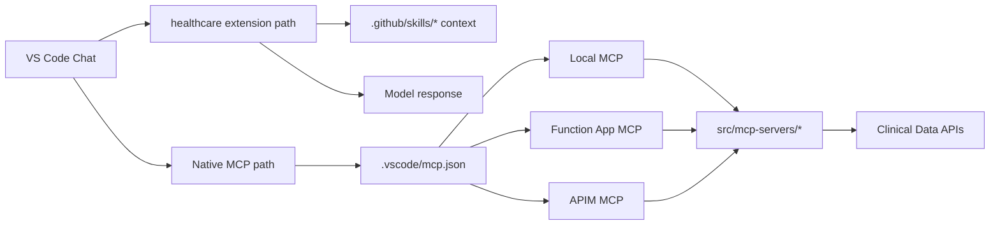
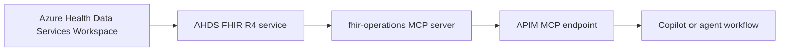
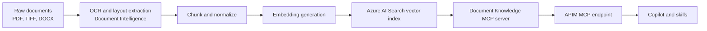

# Developer Guide: Leverage, Test, and Iterate

This guide is the fastest way to get productive in this repository.

## 1) Repo Map

Use this mental model first:

- `.github/skills/`: static domain knowledge used by assistants and chat participants.
- `src/mcp-servers/`: six Python Azure Function MCP servers (`npi-lookup`, `icd10-validation`, `cms-coverage`, `fhir-operations`, `pubmed`, `clinical-trials`).
- `src/agents/`: multi-agent orchestration layer (CLI + Gradio DevUI + framework DevUI).
- `scripts/`: local launchers, APIM connectivity tests, and post-deploy MCP config generation.
- `vscode-extension/`: VS Code `@healthcare` chat participant.
- `deploy/`: Azure Bicep infrastructure definitions.
- `azure-fhir-mcp-server/`: standalone TypeScript MCP server reference implementation.

### Visual Overview



For deeper workflow maps (prior-auth + clinical-trial), see `docs/SKILLS-FLOW-MAP.md`.

## 2) First-Time Setup

Install baseline tools:

- Python `3.11+`
- Node.js `18+`
- Azure Functions Core Tools v4 (`func`)
- Azurite
- Azure CLI (`az`)
- Azure Developer CLI (`azd`) for cloud deploy/test flows

Prepare agent runtime dependencies:

```bash
cd src/agents
python3 -m venv .venv
source .venv/bin/activate
pip install -r requirements.txt
```

Configure agent environment:

```bash
cp .env.example .env
```

Then edit `src/agents/.env` with your Azure OpenAI values and endpoint mode:

- Local MCP mode: use `--local` and localhost MCP URLs.
- APIM passthrough mode: set `APIM_BASE_URL` and `APIM_SUBSCRIPTION_KEY`.

### How AHDS Fits FHIR (Quick View)



Implementation anchors:

- AHDS FHIR deployment: `deploy/infra/modules/health-data-services.bicep`
- FHIR URL wiring into Function Apps: `deploy/infra/main.bicep`, `deploy/infra/modules/function-apps.bicep`
- FHIR MCP runtime: `src/mcp-servers/fhir-operations/function_app.py`
- Role assignment for FHIR access: `deploy/infra/main.bicep`

For a deeper architecture explanation, see `docs/architecture/APIM-ARCHITECTURE.md`.

## 3) Local Development Loops

### A. Iterate on MCP Servers

Run one server:

```bash
./scripts/local-test.sh npi-lookup 7071
```

Run all six servers:

```bash
make local-start
make local-logs
make local-stop
```

Smoke test any running server:

```bash
curl http://localhost:7071/.well-known/mcp | jq
curl -X POST http://localhost:7071/mcp \
  -H "Content-Type: application/json" \
  -d '{"jsonrpc":"2.0","id":1,"method":"tools/list","params":{}}' | jq
```

### B. Iterate on Agent Workflows

Activate the agent venv and run demo workflows from `src/`:

```bash
cd src
source agents/.venv/bin/activate
python -m agents --workflow prior-auth --demo --local
python -m agents --workflow clinical-trial --demo --local
python -m agents --workflow literature-search --demo --local
```

Run UIs:

```bash
python -m agents --devui --local --port 7860
python -m agents --framework-devui --local --port 8080
```

### C. Leverage the Prior-Auth Workflow End to End

Run the orchestration flow with the prior-auth sample request:

```bash
cd src
source agents/.venv/bin/activate
python -m agents \
  --workflow prior-auth \
  --input ../.github/skills/prior-auth-azure/assets/sample/pa_request.json \
  --local
```

This flow is designed as:

1. Intake and assessment (provider/code/policy + clinical evidence mapping).
2. Human decision point (review or override).
3. Decision output generation.

Key output artifacts:

- `waypoints/assessment.json`
- `waypoints/decision.json`

### D. GitHub Copilot Easy Path: Update `.vscode/mcp.json`

For Copilot usage, keep setup simple: add MCP servers in `.vscode/mcp.json`.

Because this repo already has `.github/skills/*`, skills are visible to Copilot and can be invoked without extra registration.

Option 1: local MCP servers (fastest for dev)

```jsonc
{
  "servers": {
    "local-npi-lookup": {
      "type": "http",
      "url": "http://localhost:7071/mcp"
    },
    "local-icd10-validation": {
      "type": "http",
      "url": "http://localhost:7072/mcp"
    }
  }
}
```

Option 2: direct Function App MCP endpoint

```jsonc
{
  "servers": {
    "healthcare-npi-lookup-direct": {
      "type": "http",
      "url": "https://<function-app-name>.azurewebsites.net/mcp",
      "headers": {
        "x-functions-key": "${input:npiFunctionKey}"
      }
    }
  },
  "inputs": [
    {
      "id": "npiFunctionKey",
      "type": "promptString",
      "description": "Function key",
      "password": true
    }
  ]
}
```

Important network check for direct Function App access:

- Ensure Public network access is enabled.
- Ensure Access restrictions allow your client IP/subnet.
- If public access is disabled (private endpoint only), use APIM or local MCP instead.

Option 3: APIM-hosted MCP endpoint (recommended shared setup)

```jsonc
{
  "servers": {
    "healthcare-npi-lookup-pt": {
      "type": "http",
      "url": "https://<apim-name>.azure-api.net/mcp-pt/npi/mcp",
      "headers": {
        "Ocp-Apim-Subscription-Key": "${input:apimKey}"
      }
    }
  },
  "inputs": [
    {
      "id": "apimKey",
      "type": "promptString",
      "description": "APIM subscription key",
      "password": true
    }
  ]
}
```

### E. Add an OCR + RAG Knowledge Layer (Unstructured Docs)

If you need retrieval across large sets of unstructured documents (clinical notes, scanned PDFs, policy PDFs), add a dedicated knowledge layer behind MCP.



Suggested placement in this repo:

- Ingestion jobs/scripts: `scripts/` or separate data pipeline repo.
- Index and storage infra: `deploy/infra/modules/` (AI Search + Blob/Cosmos metadata).
- Retrieval runtime: new MCP server under `src/mcp-servers/document-knowledge/` (recommended extension).
- Client wiring: `.vscode/mcp.json` via local endpoint during development, APIM endpoint in shared environments.

Example MCP registration in `.vscode/mcp.json` (APIM):

```jsonc
{
  "servers": {
    "healthcare-doc-knowledge-pt": {
      "type": "http",
      "url": "https://<apim-name>.azure-api.net/mcp-pt/docs/mcp",
      "headers": {
        "Ocp-Apim-Subscription-Key": "${input:apimKey}"
      }
    }
  }
}
```

Skill and prompt updates to make this useful:

1. Skill contract:
- Update `SKILL.md` prerequisites to include a document-knowledge MCP connector.
- Add retrieval policy in `SKILL.md` (for example: retrieve evidence first, then run decision logic).
2. Tool reference:
- Add tool entries in `references/tools.md` (for example `search_knowledge`, `get_document_chunk`, `get_document_citations`).
3. Step logic:
- In workflow refs (for example prior-auth intake step), add explicit calls to retrieve evidence chunks before policy mapping.
4. Output rules:
- Require citations in agent output (`document_id`, `chunk_id`, `source`, `score`) for auditability.

For architecture-level implementation details, see `docs/architecture/RETRIEVAL-ARCHITECTURE.md`.

### F. Prior-Auth in Copilot: Use Document Context

For PA reviews in Copilot Chat, include the request and clinical documents in chat context, then use `@healthcare /pa`.

Recommended document set:

- `.github/skills/prior-auth-azure/assets/sample/pa_request.json`
- `.github/skills/prior-auth-azure/assets/sample/ct_chest_report.txt`
- `.github/skills/prior-auth-azure/assets/sample/pulmonology_consultation.txt`
- `.github/skills/prior-auth-azure/references/rubric.md`

Example prompts:

```text
@healthcare /pa Review the attached PA request and clinical documents.
Use rubric.md as the decision policy and return a draft assessment with APPROVE or PEND only.
```

```text
@healthcare /pa Map each policy criterion to evidence from the attached documents.
List missing evidence and what additional documentation is required.
```

### G. Copilot Skills Structure (Reference)

For prior authorization, these files are the core behavior surface:

- `.github/skills/prior-auth-azure/SKILL.md`: workflow orchestration and behavior.
- `.github/skills/prior-auth-azure/references/rubric.md`: decision policy and thresholds.
- `.github/skills/prior-auth-azure/references/tools.md`: MCP tool contracts and usage.
- `.github/skills/prior-auth-azure/assets/sample/`: test request and clinical documents.
- `.github/skills/prior-auth-azure/templates/`: structured request payload templates.

When iterating on behavior, update `SKILL.md` and `references/` first, then re-test with sample assets.

### H. Iterate on Skills

Edit or add skills in `.github/skills/<skill-name>/`:

- Keep instructions in `SKILL.md`.
- Keep examples/assets in `assets/` and references in `references/`.
- Validate behavior from VS Code Copilot Chat with `@healthcare` commands.

### I. Iterate on VS Code Extension

```bash
cd vscode-extension
npm install
npm run compile
npm run lint
```

To package for manual install:

```bash
npx vsce package
```

### J. Iterate on TypeScript MCP Server

```bash
cd azure-fhir-mcp-server
npm install
npm run build
npm run test
```

## 4) Integration and Cloud Testing

Generate `.vscode/mcp.json` from azd outputs:

```bash
make setup-mcp-config
```

Validate APIM passthrough connectivity:

```bash
./scripts/test-apim-passthrough.sh --all
```

Provision and deploy with azd:

```bash
azd up
```

See `deploy/README.md` for infra details and `docs/MCP-OAUTH-PRM.md` for OAuth/PRM behavior.

## 5) Practical Test Checklist

Before opening a PR, run checks matching changed areas:

1. MCP server change:
- Start the target server with `scripts/local-test.sh`.
- Verify `/.well-known/mcp`, `initialize`, and `tools/list`.
2. Agent workflow change:
- Run at least one impacted workflow with `python -m agents ... --demo`.
- Confirm expected outputs in `waypoints/` or configured output directory.
3. APIM/policy change:
- Run `scripts/test-apim-passthrough.sh --all`.
4. VS Code extension change:
- `npm run compile` and `npm run lint` in `vscode-extension`.
5. TypeScript MCP server change:
- `npm run build` and `npm run test` in `azure-fhir-mcp-server`.

## 6) Related Docs

- `docs/SKILLS-FLOW-MAP.md`
- `docs/MCP-SERVERS-BEGINNER-GUIDE.md`
- `docs/LOCAL-TESTING.md`
- `docs/MCP-OAUTH-PRM.md`
- `docs/architecture/APIM-ARCHITECTURE.md`
- `docs/architecture/RETRIEVAL-ARCHITECTURE.md`
- `deploy/README.md`
- `vscode-extension/README.md`
