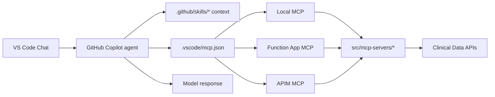
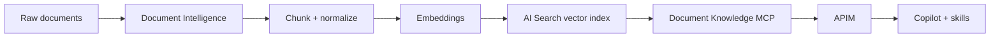

# Getting Started

> Consolidated guide for developer setup, local testing, and MCP server reference.
>
> For the business case and architecture overview, see the [main README](../README.md).

---

## 1) Repo Map

```
.github/skills/        → Domain knowledge used by Copilot and agent workflows
src/mcp-servers/       → Python Azure Function MCP servers
src/agents/            → Multi-agent orchestration layer (CLI + Gradio DevUI)
scripts/               → Local launchers, APIM tests, post-deploy config
deploy/                → Azure Bicep infrastructure definitions
```

### Visual Overview



---

## 2) Prerequisites

| Tool | Version | Install |
|------|---------|---------|
| Python | 3.11+ | `brew install python@3.11` |
| Node.js | 18+ | `brew install node` |
| Azure Functions Core Tools | v4 | `brew install azure-functions-core-tools@4` |
| Azurite | latest | `npm install -g azurite` |
| Azure CLI | latest | `brew install azure-cli` |
| Azure Developer CLI (azd) | latest | `brew install azd` |
| Docker & Docker Compose | latest | [docs.docker.com](https://docs.docker.com/get-docker/) |
| pre-commit | latest | `pip install pre-commit` |

---

## 3) First-Time Setup

### 3a. Clone and configure pre-commit

```bash
git clone <repo-url> && cd healthcare-for-microsoft
pre-commit install
```

### 3b. Agent runtime

```bash
cd src/agents
python3 -m venv .venv
source .venv/bin/activate
pip install -r requirements.txt
```

### 3c. Environment file

```bash
cp .env.example .env
```

Edit `src/agents/.env` with your Azure OpenAI values. Key modes:

- **Local MCP**: use `--local` flag and `localhost` MCP URLs.
- **APIM passthrough**: set `APIM_BASE_URL` and `APIM_SUBSCRIPTION_KEY`.

If you already deployed with `azd`, hydrate local runtime values from the active azd environment:

```bash
make sync-local-env
```

This writes `.env.local` (gitignored) with endpoints such as `AZURE_AI_SERVICES_ENDPOINT` and `COSMOS_DB_ENDPOINT` for local MCP workflows.

---

## 4) MCP Server Reference

### What is an MCP server?

An HTTP endpoint speaking JSON-RPC over `POST /mcp` with discovery at `GET /.well-known/mcp`. In this repo every MCP server is an Azure Function under `src/mcp-servers/`.

### Port map

| Server | Folder | Local Port | APIM Path |
|--------|--------|------------|-----------|
| NPI Lookup | `src/mcp-servers/npi-lookup` | 7071 | `/mcp/npi` |
| ICD-10 Validation | `src/mcp-servers/icd10-validation` | 7072 | `/mcp/icd10` |
| CMS Coverage | `src/mcp-servers/cms-coverage` | 7073 | `/mcp/cms` |
| FHIR Operations | `src/mcp-servers/fhir-operations` | 7074 | `/mcp/fhir` |
| PubMed | `src/mcp-servers/pubmed` | 7075 | `/mcp/pubmed` |
| Clinical Trials | `src/mcp-servers/clinical-trials` | 7076 | `/mcp/clinical-trials` |

### Server details

#### NPI Lookup

- **Use case**: Provider identity checks and NPI validation.
- **Upstream**: CMS NPI Registry (`npiregistry.cms.hhs.gov`).
- **Tools**: `lookup_npi`, `search_providers`, `validate_npi`.

#### ICD-10 Validation

- **Use case**: Diagnosis code validation and lookup.
- **Upstream**: NLM Clinical Tables ICD-10-CM API.
- **Tools**: `validate_icd10`, `lookup_icd10`, `search_icd10`, `get_icd10_chapter`.

#### CMS Coverage

- **Use case**: Medicare coverage lookups and medical-necessity checks.
- **Data**: Simplified local knowledge base with simulated search responses.
- **Tools**: `search_coverage`, `get_coverage_by_cpt`, `get_coverage_by_icd10`, `check_medical_necessity`, `get_mac_jurisdiction`.

#### FHIR Operations

- **Use case**: Patient-centric FHIR queries and resource validation.
- **Upstream**: Azure Health Data Services FHIR service (`FHIR_SERVER_URL`) or public HAPI FHIR fallback.
- **Tools**: `search_patients`, `get_patient`, `get_patient_conditions`, `get_patient_medications`, `get_patient_observations`, `get_patient_encounters`, `search_practitioners`, `validate_resource`.
- **Note**: Set `FHIR_SERVER_URL` in `local.settings.json` or app settings for real AHDS data.

#### PubMed

- **Use case**: Literature search and article retrieval.
- **Upstream**: NCBI E-utilities (PubMed).
- **Optional env**: `NCBI_API_KEY` (recommended for higher throughput).
- **Tools**: `search_pubmed`, `get_article`, `get_articles_batch`, `get_article_abstract`, `find_related_articles`, `search_clinical_queries`.

#### Clinical Trials

- **Use case**: Searching ClinicalTrials.gov and retrieving trial details.
- **Upstream**: ClinicalTrials.gov API v2.
- **Tools**: `search_trials`, `get_trial`, `get_trial_eligibility`, `get_trial_locations`, `search_by_condition`, `get_trial_results`.

---

## 5) Local Development

### 5a. Run a single MCP server

```bash
./scripts/local-test.sh npi-lookup 7071
```

Or manually:

```bash
cd src/mcp-servers/npi-lookup
python -m venv .venv && source .venv/bin/activate
pip install -r requirements.txt
func start --port 7071
```

### 5b. Run all servers (Make)

```bash
make local-start   # start all six
make local-logs    # tail logs
make local-stop    # stop all
```

### 5c. Run all servers (Docker Compose)

```bash
make docker-up     # build + start
make docker-ps     # status
make docker-test   # health checks
make docker-logs   # follow logs
make docker-down   # teardown
```

> Docker containers use key `docker-default-key`. Pass via `?code=docker-default-key` or `x-functions-key` header.

### 5d. Start Azurite (if not using Docker)

```bash
azurite --silent --location /tmp/azurite --debug /tmp/azurite/debug.log
```

### 5e. Smoke tests

```bash
# Discovery
curl http://localhost:7071/.well-known/mcp | jq

# Initialize
curl -X POST http://localhost:7071/mcp \
  -H "Content-Type: application/json" \
  -d '{
    "jsonrpc":"2.0","id":1,"method":"initialize",
    "params":{"protocolVersion":"2025-06-18","clientInfo":{"name":"test-client","version":"1.0.0"}}
  }' | jq

# List tools
curl -X POST http://localhost:7071/mcp \
  -H "Content-Type: application/json" \
  -d '{"jsonrpc":"2.0","id":2,"method":"tools/list","params":{}}' | jq

# Call a tool (NPI example)
curl -X POST http://localhost:7071/mcp \
  -H "Content-Type: application/json" \
  -d '{
    "jsonrpc":"2.0","id":3,"method":"tools/call",
    "params":{"name":"lookup_npi","arguments":{"npi":"1234567890"}}
  }' | jq
```

### 5f. Seed sample payer policies into Cosmos DB

```bash
make seed-data
```

`make seed-data` now auto-syncs `.env.local` from azd outputs, starts `cosmos-rag` on port `7077` if needed, then indexes `data/policies/*.pdf`.

---

## 6) Agent Workflows

Activate the agent venv and run from `src/`:

```bash
cd src && source agents/.venv/bin/activate

# Demo workflows
python -m agents --workflow prior-auth --demo --local
python -m agents --workflow clinical-trial --demo --local
python -m agents --workflow literature-search --demo --local

# Prior-auth with sample input
python -m agents \
  --workflow prior-auth \
  --input ../data/sample_cases/prior_auth_baseline/pa_request.json \
  --local

# Dev UIs
python -m agents --devui --local --port 7860
python -m agents --framework-devui --local --port 8080
```

---

## 7) VS Code / Copilot Configuration

### Local MCP

```jsonc
// .vscode/mcp.json
{
  "servers": {
    "local-npi-lookup":       { "type": "http", "url": "http://localhost:7071/mcp" },
    "local-icd10-validation": { "type": "http", "url": "http://localhost:7072/mcp" },
    "local-cms-coverage":     { "type": "http", "url": "http://localhost:7073/mcp" },
    "local-fhir-operations":  { "type": "http", "url": "http://localhost:7074/mcp" },
    "local-pubmed":           { "type": "http", "url": "http://localhost:7075/mcp" },
    "local-clinical-trials":  { "type": "http", "url": "http://localhost:7076/mcp" }
  }
}
```

### Docker MCP

Same ports; append `?code=docker-default-key` to each URL.

### Direct Function App

```jsonc
{
  "servers": {
    "healthcare-npi-lookup-direct": {
      "type": "http",
      "url": "https://<function-app-name>.azurewebsites.net/mcp",
      "headers": { "x-functions-key": "${input:npiFunctionKey}" }
    }
  },
  "inputs": [
    { "id": "npiFunctionKey", "type": "promptString", "description": "Function key", "password": true }
  ]
}
```

### APIM Endpoint (recommended for shared environments)

```jsonc
{
  "servers": {
    "healthcare-npi-lookup-pt": {
      "type": "http",
      "url": "https://<apim-name>.azure-api.net/mcp-pt/npi/mcp",
      "headers": { "Ocp-Apim-Subscription-Key": "${input:apimKey}" }
    }
  },
  "inputs": [
    { "id": "apimKey", "type": "promptString", "description": "APIM subscription key", "password": true }
  ]
}
```

---

## 8) APIM / Cloud Testing

### Generate MCP config from deployed infra

```bash
make setup-mcp-config
```

### Test APIM passthrough

```bash
./scripts/test-apim-passthrough.sh --all
```

### OAuth token flow

```bash
APIM_URL="https://your-apim.azure-api.net"

# PRM discovery
curl "$APIM_URL/.well-known/oauth-protected-resource" | jq

# Get token
MCP_CLIENT_ID=$(az ad app list --display-name "Healthcare MCP" --query "[0].appId" -o tsv)
TOKEN=$(az account get-access-token --resource "api://$MCP_CLIENT_ID" --query accessToken -o tsv)

# Authenticated call
curl -X POST "$APIM_URL/mcp/npi/mcp" \
  -H "Authorization: Bearer $TOKEN" \
  -H "Content-Type: application/json" \
  -d '{"jsonrpc":"2.0","id":1,"method":"tools/list","params":{}}' | jq
```

### Provision and deploy

```bash
azd up
```

See `deploy/README.md` for infra details and `docs/MCP-OAUTH-PRM.md` for OAuth/PRM behavior.

---

## 9) Adding an OCR + RAG Knowledge Layer

For retrieval across unstructured documents (clinical notes, scanned PDFs):



Suggested repo placement:

- Ingestion: `scripts/` or separate pipeline repo.
- Infra: `deploy/infra/modules/` (AI Search + Blob/Cosmos).
- Runtime: new `src/mcp-servers/document-knowledge/`.
- Client: `.vscode/mcp.json`.

See `docs/architecture/RETRIEVAL-ARCHITECTURE.md` for full details.

---

## 10) PR Checklist

| Changed area | Validation |
|-------------|-----------|
| MCP server | `scripts/local-test.sh <server> <port>` → verify `/.well-known/mcp`, `initialize`, `tools/list` |
| Agent workflow | `python -m agents ... --demo` → check `waypoints/` output |
| APIM / policy | `scripts/test-apim-passthrough.sh --all` |
| Copilot configuration | validate `.vscode/mcp.json` and run one prompt that triggers MCP tools |
| Integration tests | `pytest tests/ -v` |

---

## 11) Debugging Tips

```bash
# Verbose local logs
func start --verbose

# Azure logs (post-deploy)
az webapp log tail --name healthcaremcp-npi-lookup-func --resource-group your-rg

# Health check
curl http://localhost:7071/health
```

### Common issues

| Symptom | Cause | Fix |
|---------|-------|-----|
| "No job functions found" | `function_app.py` not in correct dir | Check working directory |
| 401 from APIM | Token audience mismatch | Verify `McpClientId` |
| 502 from APIM | Cold start or VNet routing | Wait/retry or check VNet config |
| FHIR returns demo data | `FHIR_SERVER_URL` not set | Set in `local.settings.json` |
| `httpx.UnsupportedProtocol` in `cosmos-rag` | Missing/invalid `AZURE_AI_SERVICES_ENDPOINT` (or `AZURE_OPENAI_ENDPOINT`) | Run `make sync-local-env`, then restart `cosmos-rag` |
| Port mismatch | Wrong port in `func start` | Match port to server table above |

---

## 12) Related Docs

- [docs/SKILLS-FLOW-MAP.md](SKILLS-FLOW-MAP.md) — workflow diagrams for prior-auth and clinical-trial
- [docs/MCP-OAUTH-PRM.md](MCP-OAUTH-PRM.md) — OAuth/PRM behavior
- [docs/architecture/APIM-ARCHITECTURE.md](architecture/APIM-ARCHITECTURE.md) — APIM architecture
- [docs/architecture/RETRIEVAL-ARCHITECTURE.md](architecture/RETRIEVAL-ARCHITECTURE.md) — RAG architecture
- [deploy/README.md](../deploy/README.md) — infrastructure deployment
