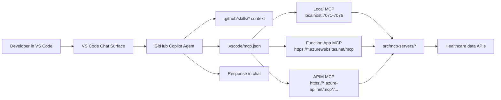
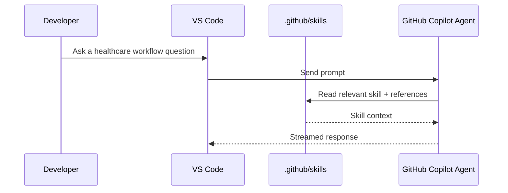
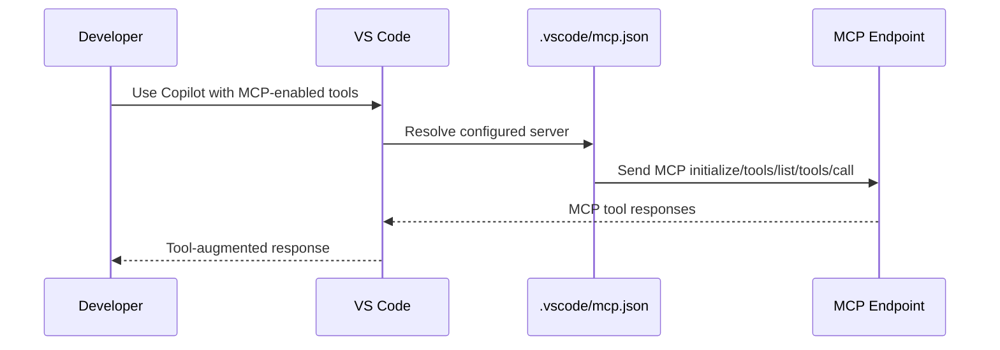
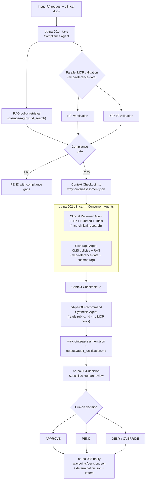
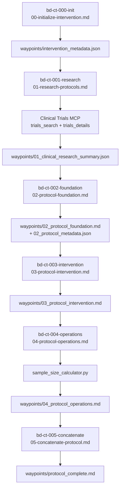
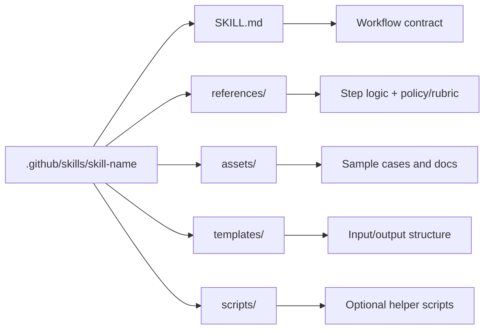
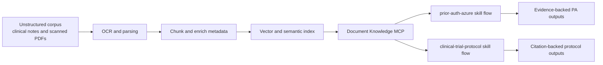
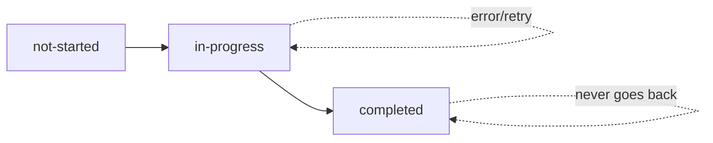

# Skills Flow Map

This document visualizes how GitHub Copilot, MCP server configuration, and the `.github/skills` workflows work together in this repository.

## 1) System Flow (Copilot + MCP)



## 2) Copilot Skills Loading Path



Notes:
- No custom VS Code chat participant is required.
- Skill routing is model-driven from repository context in `.github/skills`.

## 3) Native Copilot MCP Path (`mcp.json`)



## 4) Prior Authorization Skill Flow

Source files:
- `.github/skills/prior-auth-azure/SKILL.md`
- `.github/skills/prior-auth-azure/references/01-intake-assessment.md`
- `.github/skills/prior-auth-azure/references/02-decision-notification.md`
- `.github/skills/prior-auth-azure/references/rubric.md`



### Prior Auth Bead Tracking

| Bead ID | Phase | Agent | Status Persisted In |
|---------|-------|-------|---------------------|
| `bd-pa-001-intake` | RAG retrieval + NPI/ICD-10 compliance gate | Compliance Agent | `waypoints/assessment.json` |
| `bd-pa-002-clinical` | Clinical review + CMS coverage (concurrent) | Clinical Reviewer + Coverage Agent | `waypoints/assessment.json` |
| `bd-pa-003-recommend` | Synthesis → recommendation + audit doc | Synthesis Agent | `waypoints/assessment.json` |
| `bd-pa-004-decision` | Human review + decision capture | Human | `waypoints/decision.json` |
| `bd-pa-005-notify` | Determination JSON + notification letters | (code generation) | `waypoints/decision.json` |

## 5) Clinical Trial Protocol Skill Flow

Source files:
- `.github/skills/clinical-trial-protocol/SKILL.md`
- `.github/skills/clinical-trial-protocol/references/00-05*.md`
- `.github/skills/clinical-trial-protocol/scripts/sample_size_calculator.py`



### Clinical Trial Bead Tracking

| Bead ID | Step | Status Persisted In |
|---------|------|---------------------|
| `bd-ct-000-init` | Initialize intervention | `waypoints/intervention_metadata.json` |
| `bd-ct-001-research` | Research protocols | `waypoints/intervention_metadata.json` |
| `bd-ct-002-foundation` | Protocol foundation | `waypoints/intervention_metadata.json` |
| `bd-ct-003-intervention` | Intervention details | `waypoints/intervention_metadata.json` |
| `bd-ct-004-operations` | Operations & statistics | `waypoints/intervention_metadata.json` |
| `bd-ct-005-concatenate` | Concatenate final | `waypoints/intervention_metadata.json` |

Resume behavior reads bead state from `intervention_metadata.json` first, falling back to file-existence detection.

## 6) Skills Directory Anatomy



## 7) OCR and RAG Knowledge Layer Extension



Adoption touchpoints:
- MCP layer: add a document-knowledge server and register it in `.vscode/mcp.json`.
- Skill layer: add retrieval prerequisites in `SKILL.md` and tool definitions in `references/tools.md`.
- Prompt layer: require retrieval before synthesis and enforce source citations.

## 8) Beads Task Tracking Pattern

All skills use **beads** (`bd-*`) to track progress through multi-step workflows. Each bead represents a discrete phase, has a unique ID, and follows a `not-started → in-progress → completed` lifecycle.



### Rules

1. **One active bead** at a time (only one `in-progress`)
2. **Sequential execution** — beads complete in order
3. **Persisted in waypoints** — bead state is written to JSON waypoint files under a `"beads"` key
4. **Resume from beads** — on startup, read bead array and resume from first non-completed bead
5. **Audit trail** — each completed bead records a `completed_at` timestamp

### Bead State Schema

```json
{
  "beads": [
    {"id": "bd-XX-NNN-name", "status": "completed", "completed_at": "2026-02-10T12:00:00Z"},
    {"id": "bd-XX-NNN-name", "status": "in-progress", "started_at": "2026-02-10T12:05:00Z"},
    {"id": "bd-XX-NNN-name", "status": "not-started"}
  ]
}
```

### Skill Bead Registries

| Skill | Bead Prefix | Bead Count | Persisted In |
|-------|-------------|------------|---------------|
| Prior Authorization | `bd-pa-*` | 5 beads | `assessment.json`, `decision.json` |
| Clinical Trial Protocol | `bd-ct-*` | 6 beads | `intervention_metadata.json` |

---

## 9) Practical Reading Order

1. Open `SKILL.md` for orchestration rules.
2. Follow `references/*.md` in execution order.
3. Use `data/sample_cases/prior_auth_baseline/*` for test runs.
4. Validate MCP connectivity in `.vscode/mcp.json`.
5. Run workflow and inspect `waypoints/*`.
