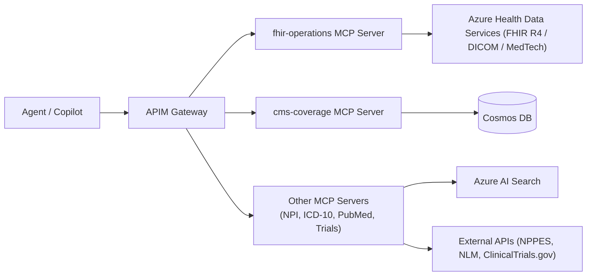

# Retrieval Architecture: AHDS, Azure AI Search & Cosmos DB

## Executive Summary

The Healthcare Marketplace uses a **multi-tier retrieval architecture** where Azure Health Data Services (AHDS) provides the clinical data foundation, Cosmos DB handles structured operational data, and Azure AI Search powers semantic retrieval:

| Data Type | Recommended Service | Rationale |
|-----------|---------------------|----------|
| Patient Records & Clinical Data | **Azure Health Data Services (FHIR R4)** | Authoritative clinical data store; FHIR-native queries via `fhir-operations` MCP server |
| Observations & Vitals | **Azure Health Data Services (FHIR R4)** | Structured clinical observations including MedTech device-ingested data |
| Medical Imaging | **Azure Health Data Services (DICOM)** | DICOMweb storage and retrieval; linked to FHIR via ImagingStudy resources |
| CMS Coverage Policies | **Cosmos DB** | Structured documents, known IDs, transactional reads |
| Provider Directory (NPI) | **External API** | NPPES API is authoritative, no need to replicate |
| ICD-10 Codes | **External API** | NLM Clinical Tables API is comprehensive |
| PubMed/Literature | **Azure AI Search** | Full-text + vector search for semantic retrieval |
| Clinical Guidelines | **Azure AI Search** | RAG over unstructured clinical content |
| Audit Logs/Waypoints | **Cosmos DB** | JSON documents, transactional writes |
| Protocol Templates | **Azure Blob + AI Search** | Large documents with semantic indexing |

### How the tiers connect



---

## Architecture Decision Records

### ADR-000: Azure Health Data Services as the Clinical Data Tier

**Status:** Accepted

**Context:**
Healthcare workflows (prior authorization, clinical trials, patient lookup) need access to structured clinical data — patient demographics, conditions, observations, medications, imaging studies, and device telemetry. This data must be:
- Stored in a standards-compliant format (HL7 FHIR R4)
- Queryable via standard FHIR search parameters
- Secured with Entra ID authentication and private endpoints
- Capable of integrating imaging (DICOM) and device data (MedTech → FHIR Observations)

**Decision:**
Use Azure Health Data Services (AHDS) as the authoritative clinical data store. The `fhir-operations` MCP server (`src/mcp-servers/fhir-operations/`) acts as the bridge, translating MCP tool calls into FHIR R4 REST queries against the AHDS FHIR service.

**Infrastructure:** `deploy/infra/modules/health-data-services.bicep` deploys:
- AHDS Workspace with HIPAA-tagged configuration
- FHIR R4 Service with system-assigned managed identity
- Private network access (public access disabled by default)
- Entra ID authentication (tenant-scoped audience)

**MCP Tools exposed via `fhir-operations`:**

| Tool | FHIR Operation | Description |
|------|---------------|-------------|
| `search_patients` | `GET /Patient?...` | Search by name, DOB, identifier |
| `get_patient` | `GET /Patient/{id}` | Retrieve patient by FHIR ID |
| `search_observations` | `GET /Observation?...` | Query vitals, labs, clinical observations |
| `get_patient_conditions` | `GET /Condition?patient={id}` | Active conditions/diagnoses |
| `get_patient_encounters` | `GET /Encounter?patient={id}` | Visit history |

**Data flow:**
1. Agent calls MCP tool (e.g., `search_patients`) via APIM
2. `fhir-operations` Azure Function authenticates to AHDS using managed identity
3. Function translates MCP parameters → FHIR search query
4. AHDS returns FHIR Bundle → Function extracts and returns structured results

**Consequences:**
- ✅ Standards-compliant clinical data access (FHIR R4)
- ✅ Unified workspace for FHIR + DICOM + MedTech
- ✅ Managed identity auth — no credentials in code
- ✅ Private Link ready for HIPAA compliance
- ⚠️ AHDS has its own pricing tier; serverless not available
- ⚠️ FHIR search is powerful but not suited for full-text/semantic retrieval (use AI Search for that)

---

### ADR-001: Cosmos DB for Structured Healthcare Data

**Status:** Accepted

**Context:**
CMS coverage policies, provider records, and audit trails require:
- Fast point reads by known ID (policy ID, NPI)
- ACID transactions for audit logging
- JSON document flexibility
- Global distribution for low latency
- Strong consistency for compliance

**Decision:**
Use Cosmos DB NoSQL API with the following containers:

```
healthcare-db/
├── coverage-policies    # CMS LCDs/NCDs
├── provider-cache       # Cached NPI lookups (TTL: 24h)
├── audit-trail         # PA review audit logs
└── waypoints           # Skill workflow checkpoints
```

**Consequences:**
- ✅ Sub-10ms reads for policy lookups
- ✅ HIPAA-compliant with encryption at rest
- ✅ Built-in TTL for cache management
- ⚠️ Higher cost than blob storage for large documents

### ADR-002: Azure AI Search for Semantic Retrieval

**Status:** Accepted

**Context:**
Clinical guidelines, PubMed literature, and protocol templates require:
- Full-text search with medical terminology
- Semantic/vector search for RAG
- Faceted navigation (by specialty, condition, year)
- Highlighting and snippets for citations

**Decision:**
Use Azure AI Search with vector search capabilities:

```yaml
indexes:
  clinical-guidelines:
    fields:
      - name: content (searchable, vector: text-embedding-3-large)
      - name: specialty (filterable, facetable)
      - name: condition (filterable, facetable)
      - name: source (filterable)
      - name: effective_date (sortable)
    
  pubmed-articles:
    fields:
      - name: title (searchable)
      - name: abstract (searchable, vector)
      - name: mesh_terms (filterable, facetable)
      - name: authors (searchable)
      - name: journal (filterable)
      - name: publication_date (sortable)
```

**Consequences:**
- ✅ Semantic search over clinical content
- ✅ Hybrid (keyword + vector) retrieval
- ✅ Built-in AI enrichment pipeline
- ⚠️ Requires index management and refresh strategy

---

## Implementation Guide

### Cosmos DB Setup

```bicep
// deploy/infra/modules/cosmos-healthcare.bicep
resource cosmosAccount 'Microsoft.DocumentDB/databaseAccounts@2024-05-15' = {
  name: 'cosmos-healthcare-${uniqueString(resourceGroup().id)}'
  location: location
  kind: 'GlobalDocumentDB'
  properties: {
    databaseAccountOfferType: 'Standard'
    consistencyPolicy: {
      defaultConsistencyLevel: 'Session'
    }
    locations: [
      { locationName: location, failoverPriority: 0 }
    ]
    capabilities: [
      { name: 'EnableServerless' }
    ]
    // HIPAA compliance
    isVirtualNetworkFilterEnabled: true
    virtualNetworkRules: [
      { id: vnetSubnetId }
    ]
  }
}

resource database 'Microsoft.DocumentDB/databaseAccounts/sqlDatabases@2024-05-15' = {
  parent: cosmosAccount
  name: 'healthcare'
  properties: {
    resource: { id: 'healthcare' }
  }
}

resource coveragePolicies 'Microsoft.DocumentDB/databaseAccounts/sqlDatabases/containers@2024-05-15' = {
  parent: database
  name: 'coverage-policies'
  properties: {
    resource: {
      id: 'coverage-policies'
      partitionKey: { paths: ['/state'], kind: 'Hash' }
      indexingPolicy: {
        automatic: true
        indexingMode: 'consistent'
        includedPaths: [{ path: '/*' }]
        excludedPaths: [{ path: '/policy_text/*' }]  // Large text not indexed
      }
    }
  }
}
```

### Azure AI Search Setup

```bicep
// deploy/infra/modules/ai-search-healthcare.bicep
resource searchService 'Microsoft.Search/searchServices@2024-03-01-preview' = {
  name: 'search-healthcare-${uniqueString(resourceGroup().id)}'
  location: location
  sku: { name: 'standard' }
  properties: {
    replicaCount: 1
    partitionCount: 1
    hostingMode: 'default'
    semanticSearch: 'standard'  // Enable semantic ranking
  }
}

// Index definition via deployment script
resource indexDeployment 'Microsoft.Resources/deploymentScripts@2023-08-01' = {
  name: 'create-search-indexes'
  location: location
  kind: 'AzureCLI'
  properties: {
    azCliVersion: '2.50.0'
    scriptContent: '''
      az search index create \
        --service-name ${searchService.name} \
        --name clinical-guidelines \
        --fields @clinical-guidelines-index.json
    '''
    supportingScriptUris: [
      'https://raw.githubusercontent.com/.../clinical-guidelines-index.json'
    ]
    retentionInterval: 'P1D'
  }
}
```

### Index Schema: Clinical Guidelines

```json
{
  "name": "clinical-guidelines",
  "fields": [
    {"name": "id", "type": "Edm.String", "key": true},
    {"name": "title", "type": "Edm.String", "searchable": true, "analyzer": "en.microsoft"},
    {"name": "content", "type": "Edm.String", "searchable": true, "analyzer": "en.microsoft"},
    {"name": "content_vector", "type": "Collection(Edm.Single)", "searchable": true, "vectorSearchDimensions": 1536, "vectorSearchProfileName": "healthcare-vector"},
    {"name": "specialty", "type": "Edm.String", "filterable": true, "facetable": true},
    {"name": "condition", "type": "Collection(Edm.String)", "filterable": true, "facetable": true},
    {"name": "icd10_codes", "type": "Collection(Edm.String)", "filterable": true},
    {"name": "source", "type": "Edm.String", "filterable": true},
    {"name": "effective_date", "type": "Edm.DateTimeOffset", "sortable": true, "filterable": true},
    {"name": "chunk_id", "type": "Edm.Int32", "sortable": true}
  ],
  "vectorSearch": {
    "algorithms": [
      {"name": "hnsw-algo", "kind": "hnsw", "hnswParameters": {"m": 4, "efConstruction": 400, "efSearch": 500, "metric": "cosine"}}
    ],
    "profiles": [
      {"name": "healthcare-vector", "algorithm": "hnsw-algo"}
    ]
  },
  "semantic": {
    "configurations": [
      {
        "name": "healthcare-semantic",
        "prioritizedFields": {
          "titleField": {"fieldName": "title"},
          "contentFields": [{"fieldName": "content"}],
          "keywordsFields": [{"fieldName": "specialty"}, {"fieldName": "condition"}]
        }
      }
    ]
  }
}
```

---

## MCP Server Integration

### CMS Coverage MCP with Cosmos DB

```python
# src/mcp-servers/cms-coverage/cosmos_client.py
from azure.cosmos.aio import CosmosClient
from azure.identity.aio import DefaultAzureCredential

class CMSCoverageStore:
    def __init__(self):
        self.credential = DefaultAzureCredential()
        self.client = CosmosClient(
            os.environ["COSMOS_ENDPOINT"],
            credential=self.credential
        )
        self.database = self.client.get_database_client("healthcare")
        self.container = self.database.get_container_client("coverage-policies")
    
    async def search_policies(
        self,
        search_term: str,
        state: str = None,
        max_results: int = 10
    ) -> list[dict]:
        """Search coverage policies with Cosmos DB query"""
        query = """
        SELECT TOP @max_results
            c.id, c.policy_id, c.title, c.policy_type, 
            c.state, c.contractor, c.effective_date,
            c.covered_icd10_codes, c.covered_cpt_codes
        FROM c
        WHERE CONTAINS(LOWER(c.title), LOWER(@search_term))
           OR CONTAINS(LOWER(c.summary), LOWER(@search_term))
        """
        params = [
            {"name": "@search_term", "value": search_term},
            {"name": "@max_results", "value": max_results}
        ]
        
        if state:
            query += " AND c.state = @state"
            params.append({"name": "@state", "value": state})
        
        results = []
        async for item in self.container.query_items(
            query=query,
            parameters=params
        ):
            results.append(item)
        
        return results
    
    async def get_policy_details(self, policy_id: str) -> dict | None:
        """Get full policy by ID"""
        try:
            return await self.container.read_item(
                item=policy_id,
                partition_key=policy_id[:2]  # State code partition
            )
        except Exception:
            return None
```

### Clinical Guidelines MCP with Azure AI Search

```python
# src/mcp-servers/guidelines/search_client.py
from azure.search.documents.aio import SearchClient
from azure.search.documents.models import VectorizedQuery
from azure.identity.aio import DefaultAzureCredential
import openai

class GuidelinesSearchClient:
    def __init__(self):
        self.credential = DefaultAzureCredential()
        self.search_client = SearchClient(
            endpoint=os.environ["SEARCH_ENDPOINT"],
            index_name="clinical-guidelines",
            credential=self.credential
        )
        self.embedding_client = openai.AsyncAzureOpenAI(
            azure_endpoint=os.environ["AOAI_ENDPOINT"],
            api_version="2024-02-01",
            azure_ad_token_provider=self._get_token
        )
    
    async def _get_embedding(self, text: str) -> list[float]:
        """Generate embedding for search query"""
        response = await self.embedding_client.embeddings.create(
            model="text-embedding-3-large",
            input=text
        )
        return response.data[0].embedding
    
    async def search_guidelines(
        self,
        query: str,
        specialty: str = None,
        condition: str = None,
        top: int = 10,
        use_semantic: bool = True
    ) -> list[dict]:
        """Hybrid search over clinical guidelines"""
        
        # Generate query embedding
        query_vector = await self._get_embedding(query)
        
        vector_query = VectorizedQuery(
            vector=query_vector,
            k_nearest_neighbors=top,
            fields="content_vector"
        )
        
        # Build filter
        filters = []
        if specialty:
            filters.append(f"specialty eq '{specialty}'")
        if condition:
            filters.append(f"condition/any(c: c eq '{condition}')")
        
        filter_str = " and ".join(filters) if filters else None
        
        # Execute hybrid search
        results = await self.search_client.search(
            search_text=query,
            vector_queries=[vector_query],
            filter=filter_str,
            top=top,
            query_type="semantic" if use_semantic else "simple",
            semantic_configuration_name="healthcare-semantic" if use_semantic else None,
            select=["id", "title", "content", "specialty", "condition", "source"]
        )
        
        docs = []
        async for result in results:
            docs.append({
                "id": result["id"],
                "title": result["title"],
                "content": result["content"][:500] + "...",
                "specialty": result.get("specialty"),
                "condition": result.get("condition"),
                "source": result.get("source"),
                "score": result["@search.score"],
                "reranker_score": result.get("@search.reranker_score")
            })
        
        return docs
```

---

## Data Ingestion Pipeline

### CMS Coverage Data Sync

```python
# scripts/sync_cms_coverage.py
"""
Sync CMS coverage data from public API to Cosmos DB
Run daily via Azure Functions Timer Trigger
"""
import asyncio
import httpx
from azure.cosmos.aio import CosmosClient

CMS_API_BASE = "https://api.cms.gov/coverage"

async def sync_coverage_policies():
    async with httpx.AsyncClient() as http:
        # Fetch latest LCDs
        response = await http.get(
            f"{CMS_API_BASE}/lcd",
            params={"limit": 1000, "modified_since": last_sync_date}
        )
        policies = response.json()["results"]
    
    async with CosmosClient(...) as cosmos:
        container = cosmos.get_database_client("healthcare").get_container_client("coverage-policies")
        
        for policy in policies:
            # Transform to our schema
            doc = {
                "id": policy["lcd_id"],
                "policy_id": policy["lcd_id"],
                "policy_type": "LCD",
                "title": policy["title"],
                "state": policy["state"],
                "contractor": policy["contractor_name"],
                "effective_date": policy["effective_date"],
                "summary": policy["summary"],
                "policy_text": policy["full_text"],
                "covered_icd10_codes": policy.get("icd10_codes", []),
                "covered_cpt_codes": policy.get("cpt_codes", []),
                "last_updated": datetime.utcnow().isoformat()
            }
            
            await container.upsert_item(doc)
```

### Clinical Guidelines Indexing

```python
# scripts/index_clinical_guidelines.py
"""
Index clinical guidelines into Azure AI Search
Run after new guidelines are added
"""
from azure.search.documents import SearchIndexingBufferedSender
import openai

async def index_guidelines(documents: list[dict]):
    """Chunk, embed, and index clinical guideline documents"""
    
    chunks = []
    for doc in documents:
        # Chunk document into ~500 token segments
        doc_chunks = chunk_document(doc["content"], chunk_size=500, overlap=50)
        
        for i, chunk in enumerate(doc_chunks):
            # Generate embedding
            embedding = await get_embedding(chunk)
            
            chunks.append({
                "id": f"{doc['id']}_chunk_{i}",
                "title": doc["title"],
                "content": chunk,
                "content_vector": embedding,
                "specialty": doc.get("specialty"),
                "condition": doc.get("conditions", []),
                "icd10_codes": doc.get("icd10_codes", []),
                "source": doc.get("source"),
                "effective_date": doc.get("effective_date"),
                "chunk_id": i
            })
    
    # Batch upload to search index
    async with SearchIndexingBufferedSender(
        endpoint=SEARCH_ENDPOINT,
        index_name="clinical-guidelines",
        credential=credential
    ) as sender:
        await sender.upload_documents(chunks)
```

---

## OCR + RAG Knowledge Layer Placement

For adoption scenarios with large unstructured corpora (clinical notes, scanned prior-auth packets, policy PDFs, protocol libraries), add a dedicated OCR + RAG knowledge layer and expose it through MCP.

```mermaid
flowchart LR
    SRC[Enterprise document sources] --> BLOB[Blob or ADLS landing zone]
    BLOB --> OCR[Document OCR and layout extraction]
    OCR --> PREP[Chunk and normalize]
    PREP --> EMBED[Embedding generation]
    EMBED --> SEARCH[Azure AI Search index]
    SEARCH --> DOCMCP[Document Knowledge MCP server]
    DOCMCP --> APIM[APIM endpoint mcp-pt or mcp]
    APIM --> CLIENT[Copilot or agent workflows]
```



### Where This Layer Fits

- Ingestion pipeline: ETL jobs in `scripts/` or a dedicated ingestion service.
- Search and metadata persistence: Azure AI Search, with optional Cosmos DB metadata container.
- MCP runtime: recommended extension at `src/mcp-servers/document-knowledge/`.
- Client connectivity: `.vscode/mcp.json` for local/dev and APIM-hosted MCP URLs for shared environments.

### MCP Tool Contract (Recommended)

| Tool | Purpose | Inputs | Outputs |
|------|---------|--------|---------|
| `search_knowledge` | Hybrid semantic/keyword retrieval | `query`, `filters`, `top_k` | Ranked chunks + scores |
| `get_document_chunk` | Fetch canonical chunk content | `document_id`, `chunk_id` | Full chunk + metadata |
| `get_document_citations` | Build citation payload for responses | `result_ids` | Citation bundle |
| `ingest_document` (optional admin) | Trigger index/update | `blob_uri`, `doc_type` | Ingestion status |

### Integration with Skills and Prompts

To use this layer in prior-auth or protocol skills:

1. Update target `SKILL.md` prerequisites to include the document-knowledge MCP server.
2. Add retrieval tools to `references/tools.md`.
3. Update step files to retrieve evidence chunks before synthesis/decision.
4. Require citations in outputs (`document_id`, `chunk_id`, `source_uri`, `retrieval_score`) for auditability.

This allows the existing skill workflows to retrieve evidence from large document corpora without changing the core orchestration model.

---

## Cost Comparison

| Service | Configuration | Monthly Cost (Est.) |
|---------|---------------|---------------------|
| **Cosmos DB** (Serverless) | 10M RU/month, 10GB storage | ~$25-50 |
| **Cosmos DB** (Provisioned) | 1000 RU/s, 10GB storage | ~$58 |
| **Azure AI Search** (Basic) | 1 replica, 1 partition | ~$75 |
| **Azure AI Search** (Standard) | Semantic search enabled | ~$250 |

**Recommendation for MVP:** Cosmos DB Serverless + AI Search Basic (~$100-125/month)

---

## Security & Compliance

### HIPAA Considerations

1. **Cosmos DB**
   - Enable encryption at rest (default)
   - Configure virtual network service endpoints
   - Enable diagnostic logging
   - Sign BAA with Microsoft

2. **Azure AI Search**
   - No PHI in search index (only reference IDs)
   - Use customer-managed keys for encryption
   - Configure private endpoints
   - Audit query logs

### Access Control

```bicep
// Managed Identity for MCP servers
resource mcpIdentity 'Microsoft.ManagedIdentity/userAssignedIdentities@2023-01-31' = {
  name: 'id-healthcare-mcp'
  location: location
}

// Cosmos DB RBAC
resource cosmosRoleAssignment 'Microsoft.DocumentDB/databaseAccounts/sqlRoleAssignments@2024-05-15' = {
  name: guid(cosmosAccount.id, mcpIdentity.id)
  parent: cosmosAccount
  properties: {
    roleDefinitionId: '${cosmosAccount.id}/sqlRoleDefinitions/00000000-0000-0000-0000-000000000002'  // Cosmos DB Data Contributor
    principalId: mcpIdentity.properties.principalId
    scope: cosmosAccount.id
  }
}

// Search RBAC
resource searchRoleAssignment 'Microsoft.Authorization/roleAssignments@2022-04-01' = {
  scope: searchService
  name: guid(searchService.id, mcpIdentity.id)
  properties: {
    roleDefinitionId: subscriptionResourceId('Microsoft.Authorization/roleDefinitions', '8ebe5a00-799e-43f5-93ac-243d3dce84a7')  // Search Index Data Reader
    principalId: mcpIdentity.properties.principalId
  }
}
```

---

## References

- [Azure Cosmos DB for Healthcare](https://learn.microsoft.com/en-us/azure/cosmos-db/solutions/healthcare)
- [Azure AI Search Vector Search](https://learn.microsoft.com/en-us/azure/search/vector-search-overview)
- [HIPAA Compliance on Azure](https://learn.microsoft.com/en-us/azure/compliance/offerings/offering-hipaa-us)
- [Healthcare APIs Best Practices](https://learn.microsoft.com/en-us/azure/healthcare-apis/fhir/security-controls-policy)
